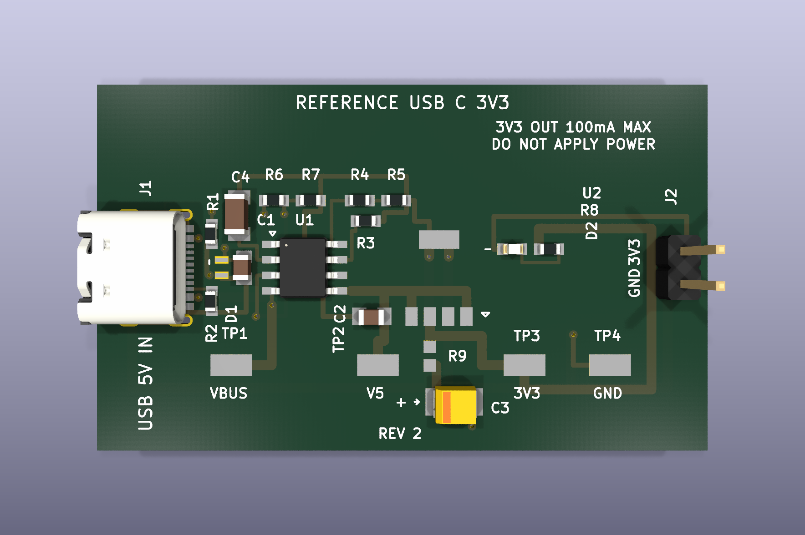

# EvlEDA

EvlEDA is a downloadable local MCP server and agent skill that lets Codex and
Claude Code work with **KiCad already installed on the user's computer**. It is
not a CAD application, does not replace KiCad's schematic or PCB editors, and
does not provide a browser, desktop studio, hosted service, HTTP endpoint,
account system, or listening socket.

The client launches `evleda-mcp` as a child process and exchanges MCP JSON-RPC
over stdin/stdout. KiCad project files remain ordinary native `.kicad_pro`,
`.kicad_sch`, and `.kicad_pcb` files that users open and edit in KiCad. KiCad is
the authoritative native editor and native ERC/DRC/render/export tool.

[Install](docs/INSTALLATION.md) · [What is different](docs/WHY_EVLEDA.md) ·
[Status](STATUS.md) · [Architecture](docs/ARCHITECTURE.md) ·
[Security](SECURITY.md)

## What EvlEDA adds

EvlEDA puts a narrow, typed boundary between an AI client and local KiCad work:

- explicit project scope instead of arbitrary filesystem or shell access;
- exact input and revision identities for proposals and results;
- deterministic parse, canonicalization, compiler-parity, and verification
  guardrails around supported operations;
- a pinned, source-preserving KiCad worker whose reports remain distinguishable
  from EvlEDA's own checks;
- explicit approval and non-release boundaries for changes and CAM artifacts.

The internal canonical model and compiler are guardrails, not a second CAD
product or editor. Their job is to make supported transformations reviewable
and fail closed when a KiCad construct cannot be represented without loss.

## Quick install

Requirements are Python 3.12+ and a local KiCad 10 installation for native
operations. Node.js is not used or required.

```sh
git clone https://github.com/lolwutboi987/evleda.git
cd evleda
python -m pip install .
evleda-mcp doctor
evleda-mcp smoke
```

Register the local stdio command directly:

```sh
# Codex CLI
codex mcp add evleda -- evleda-mcp serve --require-kicad

# Claude Code
claude mcp add evleda -s user -- evleda-mcp serve --require-kicad
```

The repository also contains installable Codex and Claude Code plugin metadata
under `plugins/evleda/`; the plugin adds the same local stdio MCP command and a
workflow skill. See [installation](docs/INSTALLATION.md) for the complete setup
and diagnostics.

`doctor` reports the exact trusted KiCad executable, version, and SHA-256. It
never selects an executable from `PATH` or an executable-selection environment
variable. If protected-platform discovery does not find KiCad, pass a reviewed
absolute `--kicad-cli` path in the MCP command.

## Runtime boundary

The MCP tool list is the contract for the active version and configuration.
Read, native verification, render, and export operations may depend on a
configured project and KiCad installation. Any mutation is available only as a
typed, feature-gated operation and must follow its exact preview/approval
contract. If a tool is not advertised, the client must not simulate it with a
shell or direct file writes.

EvlEDA never needs an inbound port. Do not start it with a web server, expose it
through a tunnel, or treat a cloud development task as a hosted runtime.

## Reference fixture

The repository includes `reference-usb-c-3v3-r2`, a deeply checked USB-C 5 V
sink to 3.3 V / 100 mA output-only board. It is a **demo and acceptance-test
fixture**, not EvlEDA's editor, not a design template silently applied to a user
project, and not a production hardware release.



Open the native project at
[`examples/reference_usb_c_3v3_r2/reference_usb_c_3v3_r2.kicad_pro`](examples/reference_usb_c_3v3_r2/reference_usb_c_3v3_r2.kicad_pro)
or inspect its
[`FINAL_VERIFICATION.md`](examples/reference_usb_c_3v3_r2/FINAL_VERIFICATION.md).
The evidence records KiCad 10.0.6 ERC/DRC results, compiler/reparse parity,
source preservation, renders, BOM, and a deliberately non-release CAM
candidate. J2 is output-only: `3V3 OUT 100mA MAX / DO NOT APPLY POWER`.

## Why this differs from a typical KiCad MCP

Many KiCad MCPs prioritize broad interactive command coverage. EvlEDA
prioritizes a smaller outcome-level surface with content-addressed evidence,
exact-revision approval, isolated source-preserving native checks, and an
explicit separation between digital verification and manufacturing release.
That safety/evidence architecture is the distinction—not a replacement editor
or a claim to have more KiCad features. See the factual
[comparison](docs/WHY_EVLEDA.md).

## Safety and limits

- The stdio process inherits the local user's permissions; install it only from
  a trusted checkout or package.
- It exposes neither a generic shell nor a generic raw-file mutation tool.
- Model prose cannot establish ERC/DRC success or authorize release.
- A clean ERC/DRC result does not prove electrical, thermal, EMC, regulatory,
  assembly, or first-article fitness.
- Unsupported KiCad constructs or stale evidence must block rather than be
  silently discarded.
- CAM outputs remain non-release candidates until qualified human and
  fabrication/assembly review closes the applicable gates.

Read [SECURITY.md](SECURITY.md) before enabling the plugin and
[docs/RELEASE_STATUS.md](docs/RELEASE_STATUS.md) before using hardware outputs.

## Development

```sh
python -m pip install -e ".[dev]"
python scripts/check_release_static.py
python -m pytest -q
python .github/scripts/validate_plugin_skill.py
```

The public project is Python-only. Local files from an earlier browser/HTTP
prototype are intentionally ignored and are not part of Git, CI, wheels,
source distributions, plugins, or the EvlEDA product.

## Compatibility identifiers

Some frozen digest-domain strings and generated KiCad library IDs retain
`flux-clone` or `FluxGenerated`. They are immutable compatibility/evidence
identifiers, not public branding or a browser-product dependency. Renaming them
would invalidate existing receipts and requires an explicit versioned migration.

## License and names

Original EvlEDA software and documentation are licensed under
[Apache-2.0](LICENSE). Hardware designs and examples are licensed under
[CERN-OHL-P-2.0](LICENSES/CERN-OHL-P-2.0.txt). See [NOTICE](NOTICE) and
[THIRD_PARTY_NOTICES.md](THIRD_PARTY_NOTICES.md) for controlling scope.

EvlEDA is independent of and is not endorsed by KiCad, the KiCad project, LF
Projects, or the Linux Foundation. KiCad trademarks are registered to the Linux
Foundation; “KiCad” is used only to describe interoperability. All other marks
belong to their owners.
