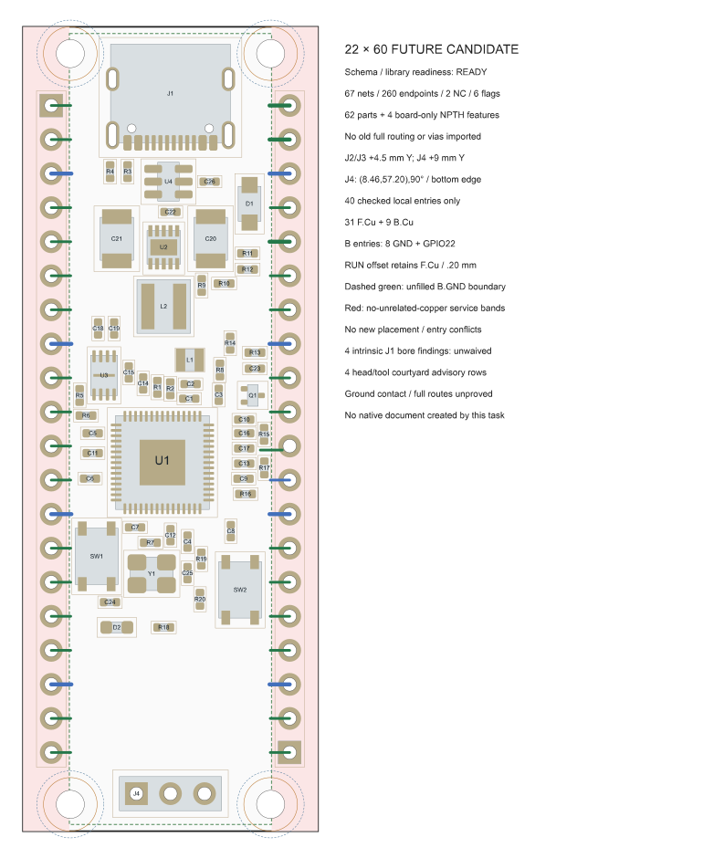

# RP2350 candidate: 60 mm long, 22 mm wide

This packet preserves the user-approved **60 mm length, 22 mm width and two copper
layers**, with **2.54 mm header pitch and 17.78 mm row spacing**. It contains the
reviewed draft, intended placements and local copper-entry proposals. The draft
compiled **READY**, but these artifacts are planned source geometry: **this packet
did not create or verify a native KiCad document**. Full routing remains pending.

See the [current project status](../../../docs/current-status-and-roadmap.md) for
separately recorded native work. Results for the earlier 22 × 51 mm V9 board do
not qualify this candidate. The longer board is not a Pico mechanical drop-in.

[Open the vector overview](candidate-overview.svg). This is a source-model diagram,
not a native KiCad render or a routed-board preview.

## Intended placement and access

The [62 target poses](target-poses.json) deliberately keep USB-C at the top, its
protection and the regulator below it, the flash beside the central RP2350A,
BOOTSEL/RUN and the crystal below the MCU, and SWD at the bottom. The original
circuit inventory remains 62 electrical components, 67 nets, 260 endpoints,
2 no-connect pins and 6 source-bound power flags.

J2 and J3 retain their lands and drills, with the header rows at x = 2.11 and
19.89 mm and pin centers spanning y = 5.87–54.13 mm. Their edge preferences are
left and right. J4 moves to (8.46, 57.2) mm at 90° to retain bottom-edge access.
Four separate mounting holes have 2.10 mm bores, centered at x = 3.53/18.47 mm
and y = 2/58 mm. Existing clearance floors remain unchanged.

The full-height header service bands are x = 0–3.46 mm and 18.54–22 mm, on both
copper layers. Keep unrelated tracks and vias out of these bands; only the
original header lands/barrels and the exact inward entry geometry are exceptions.
The current closed-contract schema does not encode arbitrary track/via keepouts
for these bands, so this remains explicit planning and verification scope in
[input-proposal.json](input-proposal.json).

## Local entries and source checks

[local-entry-proposal.json](local-entry-proposal.json) contains **40 proposed
header entries: 31 on F.Cu and 9 on B.Cu**. The back entries are GPIO22 and all
8 GND spokes. RUN retains its 0.20 mm front-layer entry and checked offset. No
ordinary via is introduced. These short entries are not completed routes; the
[posed source model](source-physical-model.json) contains zero accepted tracks,
zero ordinary vias and no filled plane.

The source checks matched all 62 electrical footprint bindings; four board-only
features complete the 66-footprint library inventory. They report no newly
introduced hard placement findings and no local-entry or mutual-entry findings
for the selected poses. The 265 copper pads, 230 paste apertures and 53 hole
envelopes are source-model counts, not new native readback evidence. The checked
route-length lower bounds do not prove routability, timing, coupling or returns.

The proposed B.GND rectangle spans x = 3.46–18.54 mm and y = 0.50–59.50 mm.
Its overlap with the eight back-layer GND spokes does not establish a connected
filled component or actual trace-to-fill contact.

## Findings retained without waiver

- **Four USB-C pad-to-internal-NPTH findings remain open:** J1.A1, J1.A12,
  J1.B1 and J1.B12 each have approximately **0.194403 mm clearance against
  the unchanged 0.25 mm requirement**. Compiler readiness does not clear them.
- **Four head/tool-to-USB-courtyard advisories remain:** at the two upper holes,
  the nominal head-to-courtyard gap is 0.15 mm and the driver envelope overlaps
  the courtyard by 0.35 mm. The modeled hardware uses a 4 mm head diameter,
  2.2 mm head height and 5 mm vertical driver envelope; no actual fastener/tool
  part or tolerance is selected. Pad/body checks pass under those assumptions.
  Heads nominally meet the board ends, and driver envelopes extend 0.5 mm beyond
  them. Assembly access, installed headers, board support and enclosure fit still
  need disposition.

Full GPIO, USB and power routing; bypass-loop and return-path qualification;
ground connectivity and fill; native placement/routing checks and DRC; electrical
verification; and fabrication acceptance remain unfinished. Historical copper
was not imported as accepted routing.

## Artifact and identity record

| Artifact | Purpose |
| --- | --- |
| [candidate-draft.json](candidate-draft.json) | Exact proposed input for new-document creation |
| [target-poses.json](target-poses.json) | Intended poses, retained separately from the contract schema |
| [source-physical-model.json](source-physical-model.json) | Posed source geometry before routing |
| [local-entry-proposal.json](local-entry-proposal.json) | Exact 40 local-entry proposals |
| [input-proposal.json](input-proposal.json) | Mechanical changes, service bands and inherited planning scope |
| [closed-contract.json](closed-contract.json) | Compiled closed contract |
| [compilation.json](compilation.json) | READY result and bound input/library/profile identities |
| [physical-check.json](physical-check.json) | Source checks, retained findings and their numerical evidence |
| [library-binding.json](library-binding.json) | Exact selected library bindings |
| [manifest.json](manifest.json) | Local file hashes and exact upstream provenance |
| [source-manifest.json](source-manifest.json) | Original packet manifest; also lists upstream-only builder files |

All 19 files in the upstream manifest were hash- and size-verified before copying
the 11 selected artifacts. Their bytes are unchanged. The local manifest also
records the copied upstream manifest and this delivery README. Machine-specific
builder scripts and the redundant base draft remain upstream.

The initial draft SHA-256 is
`ba4b1682837bc3e0d18ad5f0a3c6eac6f2457857e12ad617e32b815a28499f5e`.
The canonical closed-contract identity is
`59a0d32f12acb3224644513f0028f6d57c3e9c462c285ffddbb84cfcf23e2ee1`;
its serialized file hash is separately recorded in the manifest.
