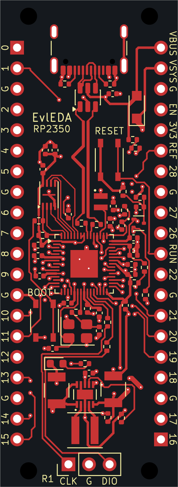

# RP2350 four-layer routed review candidate

**The complete layout is available here for inspection.** All 67 functional nets
are connected in the native physical-pad review, and configured native ERC/DRC
report zero findings. This is the reviewed native target; adoption through the
managed EvlEDA save/checkpoint workflow and final engineering acceptance are
still pending. It is not a manufacturing release.

Open the [KiCad project](native/rp2350-pico-4layer.kicad_pro),
[PCB](native/rp2350-pico-4layer.kicad_pcb) or
[schematic](native/rp2350-pico-4layer.kicad_sch) in KiCad 10 with its standard
libraries installed. The custom library and its notices are included. Its paths
are relative to the project; the four native design files are byte-exact copies
of the checked target.

[Assembly view](previews/assembly.png) · [Top SVG](previews/top.svg) ·
[Assembly SVG](previews/assembly.svg) · [Header pinout](pinout.md) ·
[Candidate BOM](bom-candidates.csv) · [BOM notes](bom-notes.md)

[Schematic preview](previews/schematic.png) · [Zoomable schematic SVG](previews/schematic.svg)

The single-sheet schematic was exported by native KiCad and visually reviewed;
its dense label-based circuit remains legible when zoomed. All six source files
stayed unchanged through that export; [preview custody](verification/schematic-preview-custody.json)
records the bindings.

## Board and placement

The board is **22 x 60 mm, four layers**, retaining 2.54 mm GPIO pitch and
17.78 mm row spacing. It has 62 electrical components, four bare mounting bores,
1,099 tracks and 118 through-vias. USB-C/protection is at the top; the MCU, its
nearby decoupling, flash and clock occupy the middle; the external buck-boost
power stage is at the bottom. BOOT, RESET and bottom-edge SWD access remain
accessible. The [placement review](verification/engineering-review.md) records
the actual locations and intent.

F.Cu carries components and the declared USB, QSPI, clock and debug routes.
In1.Cu is the dedicated ground plane. In2.Cu carries signals/power plus
supplemental ground fill, and B.Cu carries the remaining routes. The
[construction declaration](basis/construction.json) retains the exact 1.016 mm
native sum separately from the supplier's nominal 1 mm description. Dielectric
constants, losses and mask properties remain declared analysis assumptions.

## Verified on these saved files

| Check | Result |
| --- | --- |
| Native connectivity | 265 individually queried named physical pads; all 67 functional nets connected; no foreign-net pad reachability |
| Native ERC / DRC | Zero configured findings, zero unconnected items and zero schematic-parity findings |
| Sequential trace turns | 887 measured; zero violations of the straight/45-degree policy |
| Branch contacts | Six generic notices retained and mapped to actual pad/via centres; all 67 production numerical route checks pass |
| GPIO service strips | No unrelated copper or vias in either full-height outer strip; 42 exact own-pad inward leads allowed across the copper layers; all 7,142 saved fill vertices checked |
| USB source geometry | Polarity mapping, topology, width, minimum gap, length, skew, stub/uncoupled budgets and transition restrictions pass their declared checks |
| Reference coverage | 145 segments on 19 declared nets assessed; all USB, QSPI and crystal nets covered at their original margins; debug findings below remain |
| Portable copy | Custom library included; only two library URI prefixes changed; native ERC/DRC remain zero and original sources remain unchanged |

[Native connectivity](verification/native-connectivity.json),
[DRC](verification/native-drc.json), [ERC](verification/native-erc.json),
[source audit](verification/source-audit.json),
[USB assessment](verification/usb-source-assessment.json),
[reference coverage](verification/reference-coverage.json),
[portable-copy custody](verification/portable-copy-manifest.json),
[native checks of the repository copy](verification/publication-native-check.json).

The DRC configuration ignores missing_courtyard, track_not_centered_on_via,
tuning_profile_track_geometries, footprint_filters_mismatch and
footprint_type_mismatch. ERC ignores single_global_label, four_way_junction,
simulation_model_issue and footprint_filter. Their exact lists remain in the
native reports; zero findings is not a claim of unrestricted checker coverage.

## Remaining limits

- **Managed delivery is pending.** These files were prepared and checked as an
  unmanaged native review copy. The public EvlEDA authoring job is applying this
  geometry to its owned project. This archive does not claim its final save,
  checkpoint, normal close or read-only reopening succeeded.
- **Debug return paths are not fully qualified.** Two header approaches are
  uncovered at plated signal-pad clearances, and two SWDIO_MCU segments have
  boundary-uncertain coverage near the RUN via. Required margins were not
  reduced. USB/QSPI/crystal coverage does not waive these debug findings.
- **Supplemental plane policy remains unresolved.** In1 has one stored filled
  component; In2 has ten. Native DRC is clean and the ground pads are connected,
  but that does not establish the contract's separate single-component
  requirement for the supplemental In2 plane.
- **Physical impedance and operating performance are unqualified.** Coupled-gap
  coverage is not_assessed by the channel checker; the masked, plated board is
  outside its bare-conductor model. Material, temperature, current/thermal,
  connector/fastener fit and manufactured performance require later review.
  The retained [operating targets](basis/operating-constraints.md) and
  [component conditions](basis/component-selection.md) are not measured ratings.

No firmware, fabrication files, board order or manufacturing authorization is
included. Historical failed/partial boards remain preserved elsewhere.

PCB SHA-256:
`06214031a5b3d8c62be8cbf4bfeabf876a110b0fc556ca3c30075f15a2a6ee11`.
The [publication custody record](verification/publication-custody.json) identifies
each copied artifact and its source.
