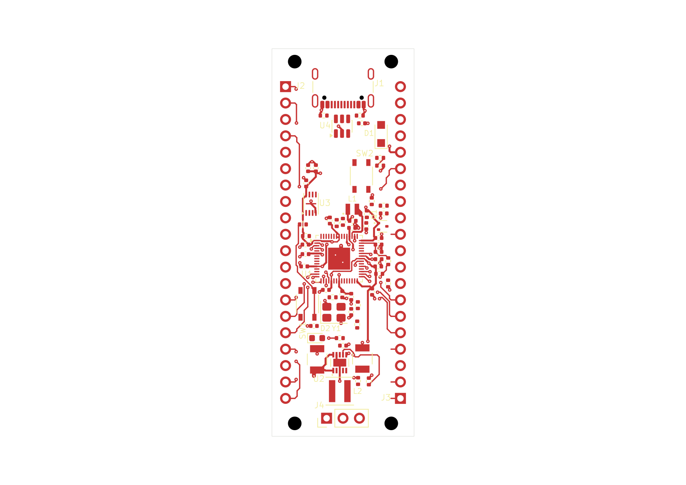

# RP2350 candidate 60-07: partial GPIO routing

This normally closed **22 × 60 mm, two-layer** snapshot has **512 segments,
87 vias and no zones**. Native endpoint checks report **20 connected nets and
47 disconnected nets**. **The board remains unfinished.** GPIO pitch is 2.54 mm
and row spacing is 17.78 mm.

Open the [project](native/rp2350-pico.kicad_pro),
[PCB](native/rp2350-pico.kicad_pcb), or
[schematic](native/rp2350-pico.kicad_sch). All six native files are exact byte
copies. Library tables retain the approved package's absolute Windows paths;
this is a design snapshot, not a portable library installation or resumable
EvlEDA allocation.

[Top SVG](previews/board-top.svg) · [Assembly PNG](previews/board-assembly.png) ·
[Assembly SVG](previews/board-assembly.svg) · [Bottom PNG](previews/native-bottom.png) ·
[Bottom SVG](previews/native-bottom.svg)

The top and assembly files are original public-tool exports. Top omits B.Cu.
Bottom is a separate read-only KiCad CLI export, rasterized on white. All three
views were inspected. Quantitative clearance and strip findings come from the
separate checks below, not image measurements.

## Added routes and native connectivity

Twenty batches add **193 segments and 29 vias** to
[60-06](../native-power-routing-60-06/README.md). Each used a fresh route
selection, mandatory native Save and fresh saved-state readback. All 512
segments and 87 vias match the [applied plan prefix](evidence/route-plan-through-30.json)
as exact integer-nanometre geometry. The
[batch journal](evidence/route-batches-11-30.jsonl) links the individual receipts.
Non-routing PCB content and the other five authored files were preserved.

The [public native endpoint report](evidence/endpoint-connectivity-report.json)
checks all 67 functional nets against the exact saved PCB. These 20 are connected,
with every eligible physical member reachable:

- 1V1, 3V3, ADC_AVDD, ADC_VREF, BOOT_SW and CORE_LX.
- GPIO0, GPIO1, GPIO2, GPIO10–GPIO15 and GPIO19–GPIO21.
- GPIO23_SMPS_PS and GPIO25_LED.

GPIO25_LED connectivity covers that control net; LED_A is still disconnected.
GPIO16/17/18/22 currently have only inward header leads. GPIO24_VBUS_SENSE and
GPIO26 remain partial. The other 47 disconnected nets, including GND and the
unfinished power/interface/control wiring, remain explicit in the report.
No component-internal conduction is inferred. Native reachability alone does
not establish shorts, intended-plane contact, fresh fill, impedance or ampacity.

The complete native observation identity covers 1,257,713 bytes. The compact
public endpoint result retains its identity and per-net findings; the full
host-private assessment remains local as
`endpoint-connectivity-b60383fc-cad3-4743-a96b-7f8a5067f6d2.json`, SHA-256
`0f611df9fa6d165b0434012b408529d8ccc75f60aa31dd9a68b3f3aee2de2461`.

## Clearance, service strips and turns

| Check | Result |
|---|---|
| Configured ERC | Zero findings. |
| Configured DRC | **FAIL:** 119 unconnected errors, 35 dangling-via warnings, 14 dangling-track warnings. |
| Clearance/courtyard/parity | No such findings reported in this configured DRC run. |
| GPIO service strips | Complete saved-source audit: zero violations and zero unknowns. |
| Sequential trace turns | 376 measured; corrected source analysis reports zero violations. |
| Junction coverage | Four existing branch junctions remain unresolved. |
| Visual QA | Eight warnings and six informational findings, unchanged from 60-06. |

The [strip audit](evidence/header-service-strip-audit.json) covers the full-height
x0–3.46 and x18.54–22 mm strips on both faces. Only exact pad-specific inward
leads are permitted; 28 current tracks use those permissions. Unrelated ground
copper receives no exemption. This is current source geometry, not proof of
soldering-abuse immunity or compliance of future copper.

DRC ignores `missing_courtyard`, `track_not_centered_on_via`,
`tuning_profile_track_geometries`, `footprint_filters_mismatch`, and
`footprint_type_mismatch`. ERC's recorded label/junction/simulation/footprint-filter
exclusions also remain in the [native checks](evidence/native-checks.json).
Zero configured findings is not unrestricted checker coverage. The DRC public
summary has complete counts but only eight of 168 finding rows. Its private
diagnostic remains local as `native-check-run_drc-6177e855-be4a-4537-b94f-9d8482a3529a.json`,
SHA-256 `e4838249b03d54cbc2cf5267a962204eca70d0a474dbbd06ea32daa45d4736b8`.

The frozen host still produces the four previously diagnosed near-zero angle
false flags. The [turn review](evidence/turn-review.json) retains them, proves
each straight with exact integer cross/dot products, and rechecks this saved
board using the previously tested angle fix. The 0.0000001-degree tolerance is
unchanged. The correction was not deployed into this frozen native session.
Four unresolved joins remain at F.Cu (10.4,29.05), F.Cu (15.5,37.14), B.Cu
(13.39,27.74), and B.Cu (11.9,30.325). They are not counted as resolved bends.

Placement retains the independently verified 66 footprints, 281 physical pad
members and 53 footprint drilled members from 60-05. The
[placement-intent map](../placement-intent-60-03.md) and the
[60-05 refinements](../native-ground-routing-60-05/README.md) describe the grouping.
Alternative EN/placement studies remain unselected. Native 3V3_EN is still
disconnected. Source-based explanation of the visual-QA warnings is retained in
[triage](evidence/visual-qa-source-triage.json); functional labels and final
silkscreen legibility remain unfinished.

## Saved identity and remaining work

- PCB: 345,871 bytes; SHA-256 `1b4b816146922ad06d0065334286c5e7c3bd06bb0682d3e4b05c726266078de0`.
- Schematic: SHA-256 `fd5f6e9cfbe046d2a1ce35ad8d17723405e727a5e7e89ffe8493fb1474e5b0eb`.
- Native allocation: `b2e1adba-cf6c-4ccf-a51f-00f63320d6eb`.
- Checkpoint: `d7be18a2968c63cffa9cbed8f33198de2816fe0a3abf8c305d60fed5fe22804c`.

All six sources matched through checks, previews and
[normal close](evidence/normal-close-proof.json). No project lease, editor lock
or unsafe marker remained; client shutdown confirmed an idle workspace.

Remaining work includes batches 31–68, the still-open signal/control routes,
ground fill and return-path checks, labels, junction review and final native
verification. The intrinsic USB pad-to-NPTH source finding remains unwaived.
The saved milestone establishes progress, not functional or manufacturing acceptance.
