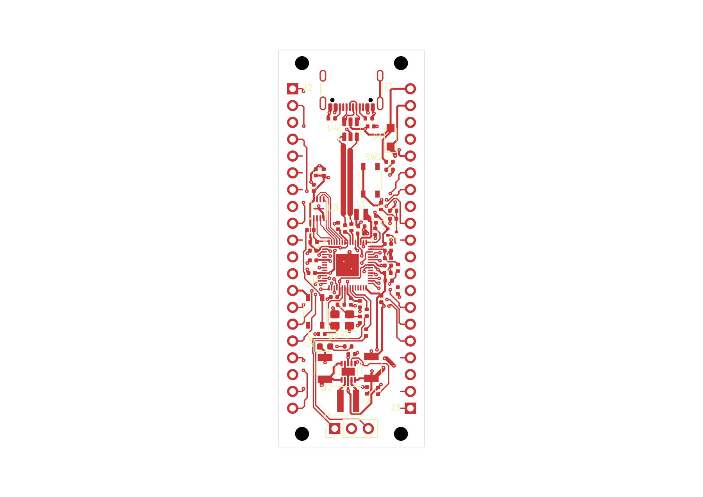

# RP2350 ground bridge — native revision 60-13

**Candidate still incomplete:** 53 functional nets are connected and 14 remain disconnected. This revision joins the C8/C20/C22 ground group to the main ground region. It adds two front copper segments and two vias; all prior routes, vias, footprints and the 22 × 60 mm outline are preserved. No USB placement proposal has been applied.

Open the [KiCad project](native/rp2350-pico.kicad_pro), [PCB](native/rp2350-pico.kicad_pcb) or [schematic](native/rp2350-pico.kicad_sch). The six files are exact saved native copies; library tables retain approved Windows paths.

[Assembly view](previews/board-assembly.png) · [Top SVG](previews/board-top.svg) · [Assembly SVG](previews/board-assembly.svg) · [Header pinout](../pinout-60mm.md)

## Change and placement intent

A **0.6 mm wide, 1.855635 mm long** front ground bridge runs from (16.000, 46.600), through (16.300, 46.600), to (17.400, 47.700) mm. A **0.55 mm diameter / 0.20 mm drill** via at each end joins the previously separate back-copper regions. The route has one 45-degree turn and stays between the two full-height GPIO service strips.

The two-via route was chosen after a longer one-via proposal introduced intersections with existing ground traces. The rejected proposal remains recorded. The adopted bridge does not add a trace junction, alter a component pose, or pass between header pads. Its source screen includes copper clearance, drill spacing, paste/body spacing, reference obstructions and the complete retained scene; native verification follows separately below.

## Verified saved result

| Check | Result |
| --- | --- |
| Tracks / vias | 831 / 106; two tracks and two vias added |
| Ground groups | **9 → 8**; main group **49 → 52 of 64 physical pads** |
| Configured DRC | **FAIL:** unconnected errors **24 → 23**; 11 dangling-track and two dangling-via warnings remain |
| Clearance / courtyard / parity | No such findings reported by this configured run |
| Configured ERC | Zero unexcluded findings; retained exclusions remain explicit |
| Literal turns | 632 measured, zero violations; same eight unresolved junctions |
| GPIO service strips | Complete source audit clear on both copper faces, with 40 exact own-pad leads |
| Refill / geometry | Mandatory native save/readback and equivalent saved/native fill geometry verified; 13 stored regions remain |
| Read-only reopen | Same eight ground groups, all six source hashes and byte-identical top/assembly PNGs; SVG drawing bytes match after excluding only the native export timestamp; normal close confirmed |
| Overall acceptance | **False**; edit assessment has 136 pass, 8 fail and 424 unknown rows |

The native connection improvement is a DC reachability result. It does not establish completed routing, acceptable return-current behavior, ampacity, thermal performance, USB impedance or manufacturing authorization. Read-only reopening does not restore fresh-fill authority; its separate plane report retains unknown authority and accepted=false.

DRC excludes missing_courtyard, track_not_centered_on_via, tuning_profile_track_geometries, footprint_filters_mismatch and footprint_type_mismatch. ERC excludes single_global_label, four_way_junction, simulation_model_issue and footprint_filter. These configured results are not unrestricted checker coverage.

## Remaining work and evidence

The disconnected nets remain 3V3_EN, GND, GPIO16, GPIO17, GPIO18, GPIO22, GPIO24_VBUS_SENSE, GPIO26, GPIO29_VSYS_SENSE, GPIO3, GPIO4, GPIO5, GPIO7 and RUN. USB resistor placement, remaining ground/signal routing, labels and electrical/DFM review are unfinished. The [USB/regulator placement study](../placement-study-20260919/README.md) remains unadopted.

See the [native endpoint report](evidence/native-endpoints.json), [plane assessment](evidence/native-plane-assessment.json), [qualified source audit](evidence/ground-bridge-qualified.json), [normal close](evidence/ground-bridge-close-proof.json) and [read-only reopen](evidence/readonly-reopen-proof.json). The route proposal retains its historical pre-authoring status; separate mutation, save and native receipts establish adoption.

Authoritative managed project: 914f7760-c4c2-4bb8-9b51-b481242878a5, host30/DOC14. PCB SHA-256: f98f02607e3af0939df8a6c6f6d3bb543a123d41c8e2937b812698e94c096f60. Final read-only-close checkpoint SHA-256: 182ab3f73e77b135eb84f1176f74acc7616e882576d9c55fe5e18e5f2a4ad5b0. The original b2e1adba project, canonical rules and immutable design bundle remain preserved.
