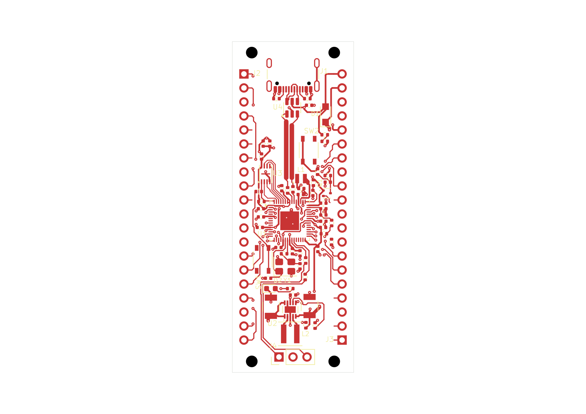

# RP2350 candidate 60-11: five ground-group connections

Ten new **0.3 mm front-copper segments** reduce GND from 17 native pad groups
to **12**, with **48 of 64 ground pads** in the largest group. No vias were
added and no components moved. The board now has **807 tracks, 104 vias and
one B.Cu ground zone**. It remains **22 × 60 mm on two layers** and is unfinished.

The new connections join the LED return to C21 ground, both RUN-button ground
pads to R14 ground, the right USB shield tabs, and C18 ground to the existing
C15 ground via. That last connection also joins the associated header ground.
The R14 approach preserves straight/45-degree turns at its existing ground lead.
The shorter direct approach was rejected because it would introduce a right angle.

Open the [project](native/rp2350-pico.kicad_pro), [PCB](native/rp2350-pico.kicad_pcb)
or [schematic](native/rp2350-pico.kicad_sch). All six files are exact native copies;
library tables retain approved absolute Windows paths.

[Top SVG](previews/board-top.svg) · [Assembly PNG](previews/board-assembly.png) ·
[Assembly SVG](previews/board-assembly.svg) · [Bottom PNG](previews/native-bottom.png) ·
[Bottom SVG](previews/native-bottom.svg) · [Header pinout](../pinout-60mm.md)

All three views were inspected. Original routing, all vias, footprints and the
five non-PCB files were preserved through two route batches and two mandatory
plane refill/save operations. The first batch added eight segments; the second
added two. Each used a fresh native selection and saved-state readback.

## Current verification

| Check | Result |
| --- | --- |
| Configured ERC | Zero findings. |
| Configured DRC | **FAIL:** 27 unconnected errors, 11 dangling-track warnings, two dangling-via warnings. |
| Clearance/courtyard/parity | No such findings reported by this configured run. |
| Functional nets | 53 connected; 14 disconnected, including GND. |
| Ground groups | 12, down from 17; largest group 48 pads, up from 40. |
| Trace turns | 608 measured; the existing USB protection-pad flag and eight unresolved junctions remain. |
| GPIO service strips | Complete source audit clear, with only the existing 39 own-pad leads permitted. |
| Visual QA | Existing eight warnings and six informational findings remain unchanged. |

See the [final collection](evidence/final-collection.json), [native checks](evidence/native-checks.json),
[first endpoint check](evidence/first-endpoint-response.json) and
[final endpoint check](evidence/second-endpoint-response.json). The exact
[first route plan](evidence/reviewed-ground-links.json) and
[existing-via connection](evidence/existing-via-links.json) retain their source
screening and native-verification boundaries.

DRC exclusions remain `missing_courtyard`, `track_not_centered_on_via`,
`tuning_profile_track_geometries`, `footprint_filters_mismatch`, and
`footprint_type_mismatch`. Clean reported clearances do not establish electrical
or manufacturing acceptance. USB resistor placement, the existing turn/junction
findings, remaining ground and signal connections, and functional labels remain open.

## Ground geometry checker

The source geometry checker now uses an exact inclusive spatial index to avoid
unrelated edge/vertex comparisons. It retains every intersection, tangency,
fracture, hole and work-limit check. The 4,000,000-operation and 8,192-vertex
limits were not increased.

An [offline replay of this saved board and its captured native fill](evidence/compiled-native-replay-60-11.json)
verifies equivalent geometry with **919,404 operations**, compared with the old
checker exhausting its limit at 4,000,001. It identifies **13 B.Cu copper regions
and two stored contour holes**; this is not the complete board-drill inventory.
Copper-region count and electrical pad-group count are different:
front tracks can connect separate bottom regions. This does not prove global
drill-clipped continuity or satisfy the single-component plane policy.

The live authoring session used host24. The compiled host25 geometry checker has
software tests and recorded-native replay; it has not yet been qualified in a
new live session. This routing milestone did not repeat the full native plane
acceptance assessment. The earlier failures in [60-10](../native-ground-plane-60-10/README.md)
remain relevant, and design acceptance remains false.

## Saved checkpoint

PCB SHA-256: `5eda3ec274a9d4e778ca3a0c576bdcd47c99f7abe4f86750489c79cc3cd45d8c`.
Checkpoint: `9a5d08a5e09fd623c094d1ef65b85ffc3ef06b8ac47b34ec0153f61f768dd127`.

[Normal close](evidence/ground-links-close-proof.json) preserved all six sources
and removed the lease, editor lock and unsafe state. SDK shutdown confirmed an
idle workspace. The remaining work is not waived by this checkpoint.
