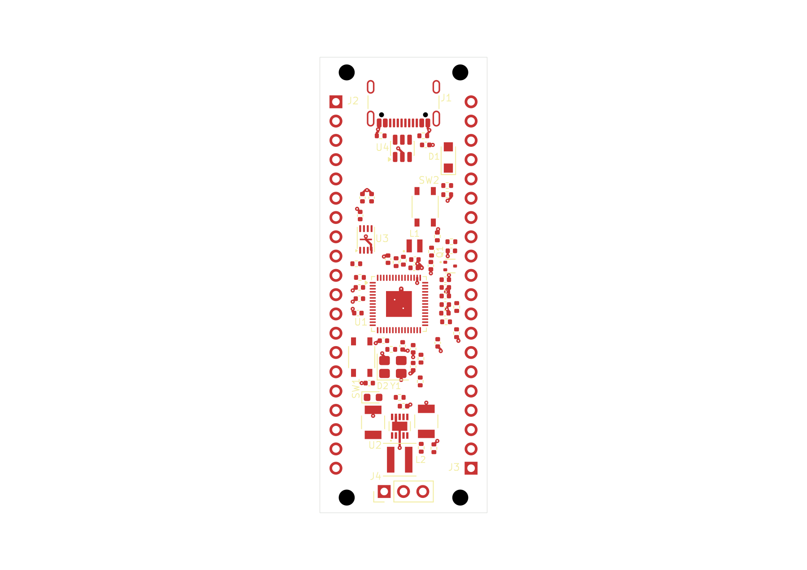

# RP2350 candidate 60-05: saved partial ground routing

This normally closed native KiCad snapshot contains **92 ground-track segments,
38 vias and no zones** on the approved **22 × 60 mm, two-layer board**. Header
pitch remains 2.54 mm and row spacing 17.78 mm. **Routing is incomplete; this is
not an accepted or manufacture-ready board.**

Open the [project](native/rp2350-pico.kicad_pro),
[PCB](native/rp2350-pico.kicad_pcb), or
[schematic](native/rp2350-pico.kicad_sch). These six native files are exact byte
copies, including rules and library tables. The tables preserve their approved
package's absolute Windows paths; this is a design snapshot, not a portable
library installation or a resumable EvlEDA allocation.

[Top SVG](previews/board-top.svg) · [Assembly PNG](previews/board-assembly.png) ·
[Assembly SVG](previews/board-assembly.svg) · [Bottom PNG](previews/board-bottom.png) ·
[Bottom SVG](previews/board-bottom.svg)

Top and assembly are the original public-tool KiCad exports and PNGs. Top omits
B.Cu. Bottom is a separate read-only native KiCad CLI export, rasterized on white;
the PCB remained unchanged. All three views were inspected.

## What changed and was verified

The previous 92-track/six-via ground batch failed because its complete native PAD
snapshot was duplicated in the response and exceeded the message bound. Under
DOC12/host20, the first 32 vias and then that exact ground batch both completed
mandatory Save and fresh readback. The saved file matches all **92 segments and
38 vias as exact integer-nanometre geometry**, with unchanged non-routing source
and the other five authored files. No evidence was truncated and limits were not
raised. See the [first-batch result](evidence/first-route-result.json),
[second-batch result](evidence/route-batch-2-result.jsonl), and
[second mutation receipt](evidence/second-route-mutation.json).
The exact [two-batch plan](evidence/ground-route-plan.json) and
[second-batch activation](evidence/second-batch-activation.json) are also retained.

Before routing, independent verification matched all **66 footprints, 281
physical pad members and 53 drilled members** to the intended placement and
complete pinned library definitions. Seven fresh public reads independently
matched 100 pad rows. The subsequent 124-field operation passed native field
verification. See [placement verification](evidence/placement-verification.json).
The four mounting holes are board-only features, not schematic/BOM components.

The existing [placement-intent map](../placement-intent-60-03.md) describes the
functional grouping. This iteration includes the reviewed SW2, R5, R7 and C12
changes: SW2 (13.85,19.70,90°), R5 (4.79,27.20,180°), R7
(9.39,38.48,180°), C12 (10.89,38.02,270°). R9/R10 alternatives and the
later EN/VSYS studies remain unselected.

## Native findings and remaining work

| Check | Actual result |
|---|---|
| ERC | Zero findings in the configured run. |
| DRC | **FAIL:** 181 unconnected errors, 34 dangling-via warnings and eight dangling-track warnings. |
| Clearance/courtyard/parity | No such findings reported in that configured DRC run. |
| GPIO service strips | Saved-source audit clear on both faces: 92 tracks, 38 vias, 281 pads; zero violations or unknowns. |
| Trace bends | 44 measured sequential turns, zero violations; one junction remains unresolved by the checker. |
| Visual QA | Eight warnings and six informational findings retained with source-based triage. |

DRC ignores five categories: `missing_courtyard`, `track_not_centered_on_via`,
`tuning_profile_track_geometries`, `footprint_filters_mismatch`, and
`footprint_type_mismatch`. This is not unrestricted DRC coverage. The dangling
ground features still need the intended filled plane and fresh connectivity
verification; no zone has been authored here. General electrical/profile checks
remain unverified, distinct from the route writer's numerical enforcement.

The [header-strip audit](evidence/header-service-strip-audit.json) uses the actual
saved board and both full-height side strips, x0–3.46 and x18.54–22 mm. Only
exact pad-specific inward leads are permitted; eight current ground leads use
those permissions. Unrelated copper receives no GND exemption. This checks
current copper geometry, not soldering-abuse immunity or future routing.

The unresolved B.Cu junction is at **(13.39,27.74)**, the core input-capacitor
ground via. Three explicit return branches join there. The native
[junction crop](previews/ground-junction-crop.png) was inspected; the automated
finding remains recorded and is not counted as complete bend-rule coverage.

Visual QA's three header off-board warnings conflict with the saved in-board
courtyards. Each reported silkscreen-reference pair includes a hidden reference.
Source Fab envelopes also separate C20/U2, C21/U2 and J4/L2; some other body
envelopes are unavailable. These observations are in
[source triage](evidence/visual-qa-source-triage.json). They do not erase the raw
warnings or establish measured package/mechanical clearance.

[Native checks](evidence/native-checks.json) retain all public results. The DRC
summary preserves complete counts and explicitly returns only eight of 223
finding rows. Its full private wrapper remains locally retained as
`native-check-run_drc-56ddb5c3-97ac-405c-aaa4-7102e3b80868.json`, SHA-256
`1a09a27d9251962b54ecf8707a2d3e97f1b993ba33a3eab0ce1ce23431e43307`.
It is not published or represented as a complete inline report.

Remaining work includes the other routing batches and still-open signal/control
routes, ground fill and return-path verification, functional labels, the junction
review, and final native checks. The intrinsic USB pad-to-NPTH source finding
remains unwaived. Neither this snapshot nor its configured DRC result supplies
fabrication authorization.

## Saved identity and lifecycle

- PCB: 273,043 bytes, SHA-256 `602e4d25ae6b0ed33474ed8ad68ac9f637f8940ba1642d5fd248d922464ee394`.
- Schematic: 221,594 bytes, SHA-256 `fd5f6e9cfbe046d2a1ce35ad8d17723405e727a5e7e89ffe8493fb1474e5b0eb`.
- Native allocation: `b2e1adba-cf6c-4ccf-a51f-00f63320d6eb`.
- Checkpoint: `c2515394d4010f36a6b68e6fd0c57345dddb5eb5d76295daca18f90a77a3e0c3`.

All six source files were unchanged through checks, previews and normal close.
The [close proof](evidence/normal-close-proof.json) records matching sources and
no remaining project lease, editor lock or unsafe marker. Client shutdown then
confirmed an idle workspace. Normal close is persistence evidence, not design
acceptance. The earlier failed allocation and its evidence remain preserved.
