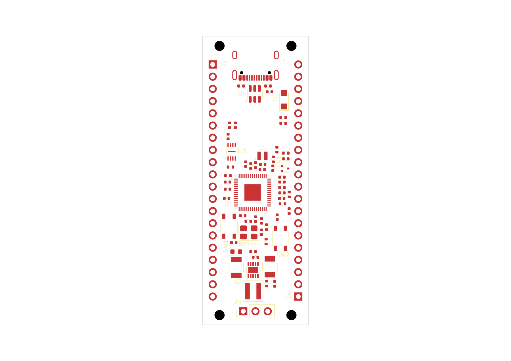

# RP2350 candidate 60-03: saved native placement

This is the normally closed, saved KiCad snapshot of candidate 60-03 after native
footprint synchronization, reviewed placement and field cleanup. The board is
**60 mm long × 22 mm wide, with two copper layers**. It retains the original
2.54 mm header pitch and 17.78 mm row spacing; it is not a Pico mechanical drop-in.

**The PCB is unrouted: zero tracks, zero vias and zero zones. It is not approved
for manufacture. Public combined validation failed at its result-size limit.**

Open [the native project](native/rp2350-pico.kicad_pro),
[PCB](native/rp2350-pico.kicad_pcb), or
[schematic](native/rp2350-pico.kicad_sch). The six authored native files are exact
byte copies, including the original library tables and design rules. The tables
retain their approved-package absolute Windows paths. This folder is a saved
design snapshot, not a portable library installation or resumable EvlEDA project
allocation. No paths or source bytes have been rewritten.

[Original top SVG](previews/board-top.svg) ·
[Original assembly PNG](previews/board-assembly.png) ·
[Original assembly SVG](previews/board-assembly.svg)

These are the original saved-source KiCad SVG exports and their original PNG
rasters, copied without cropping, recoloring or regeneration. Both native views
were inspected during the placement workflow. Their receipts report unchanged
sources and do not confer design acceptance.

## Saved state and presentation

The source contains **66 footprints**: 62 electrical components and four mounting
features. Its **281 physical pad members** comprise 265 copper members, 10
anonymous paste-only members and six NPTH members; **53 members have drills**.
These are physical-member counts, not a count of unique logical pad numbers.
The [final saved-source census](evidence/final-saved-source-census.json) records
the outline, layers, inventory and field visibility observed in the delivered PCB.

The field operation requested 124 Reference/Value updates; 115 changed and nine
already matched. Its mandatory save reported native field verification. Sixteen
major references are visible on front silkscreen; C20 and C21 have visible Fab
Reference properties. Forty-four dense passive Reference properties are hidden,
retaining their stock Fab reference text. All 62 electrical Value properties are
intentionally hidden, with their strings preserved in the native design. The
four mounting features' hidden fields were left unchanged.

Major silkscreen references are clear in the inspected top view. Small stock Fab
references retain their source sizes and orientations and may require zoom;
complete assembly readability is not claimed. Functional GPIO and connector,
button and power labels remain unfinished.

## What the verification proves

1. The [independent placement result](evidence/placement-verification-v2.json)
   passed against the **pre-field** saved PCB, SHA-256
   `115a4565a62d0a904ee20f5d51b3752f8d070b6b914b754f9278a7598c20bf61`.
   It compared all 66 saved footprint/library multisets, all 281 physical members,
   drills and the selected poses against the pinned model and contract. It also
   checked the host's 62-pose native save receipt and 92 selected public native
   pad rows: U1 (61), U2 (11), C12 (2) and J1 (18). The
   [summary](evidence/placement-verification-summary.json) distinguishes those
   native observations from the complete independent saved-source comparison.
   The retained [preparation record](evidence/placement-preparation.json) predates
   that successful result; its awaiting-evidence status is historical.
2. The [public field/save receipt](evidence/public-fields-response-329.json)
   links that pre-field PCB to staged field edits, then to the final saved PCB,
   SHA-256 `f2444cd203bea55d68a24a309992b8ef88a665dba5466cebd39d306110e3bed3`
   (253,192 bytes), with status `saved-and-native-footprint-fields-verified`.
   This is the guarded field-preservation and native-save chain. **An independent
   fresh all-pad replay against the final field-edited bytes is not claimed.**
3. The [top](evidence/public-top-preview-response-332.json) and
   [assembly](evidence/public-assembly-preview-response-337.json) export receipts
   bind the delivered previews to that final PCB and the saved schematic,
   SHA-256 `f75ee87d2c05a7ff894fa1f5aad97a0d2da96dc42cca0ee621e1350d8516adfd`
   (221,590 bytes). Both report `sourceUnchanged: true`.
4. The [normal-close response](evidence/public-normal-close-response-390.json)
   reports `closed` for project `6f574d2e-a2f3-4957-bf74-fe3c4878424c`.
   The [post-close disk verification](evidence/post-close-verification.json)
   matches all six authored source files and the workflow report, with no remaining
   lease, unsafe-state or editor-lock paths. Its checkpoint hash is provenance
   only; the checkpoint and private runtime state are not shipped as authority.

## Validation and remaining work

The [public validation response](evidence/validation/public-validation-response.json)
failed with **`KiCad MCP result exceeds the 32000-byte limit.`** The preserved
native CLI reports show that [ERC](evidence/validation/native-erc-report.json)
ran with zero violations, followed by [DRC](evidence/validation/native-drc-report.json)
with **192 unconnected errors, zero other violation rows and zero schematic-parity
rows**. All native rows are retained; repeated producer IDs must not be used to
deduplicate the 192 findings. The full original native MCP envelope was not
captured and is not reconstructed here.

DRC included error, warning and exclusion severities. Its recorded ignored checks
were `missing_courtyard`, `track_not_centered_on_via`,
`tuning_profile_track_geometries`, `footprint_filters_mismatch` and
`footprint_type_mismatch`. These coverage limits are retained in the
[diagnostic findings](evidence/validation/findings.json). Zero other native DRC
rows does not settle every source-level engineering finding: the intrinsic J1
pad-to-NPTH clearance of approximately 0.194 mm against the 0.25 mm requirement
remains unwaived and was not detected by this native report.

The wrapper stopped while projecting the DRC result; its later board-summary,
visual-QA, practice-analysis and final source-fingerprint steps were not reached.
A separate [source check](evidence/before-close-source-check.json) confirmed the
authored sources were unchanged after the error, and the
[public status](evidence/validation/public-status-after.json) was healthy before
normal close. **Neither those facts nor normal close turns the failed wrapper
into a combined validation pass.**

Routing, return-path and reference-plane findings remain unresolved. Source-level
route proposals have not been imported into this PCB. No routing completion,
filled-plane, impedance, electrical suitability, fabrication or manufacturing
acceptance is implied.

[manifest.json](manifest.json) binds the delivered files, original receipt pins,
copy checks and scope. Selected receipts retain local provenance paths; the files
they reference are not automatically included. Source checkpoints, leases,
private child logs, runtimes, credentials and vendor PDFs are excluded.
