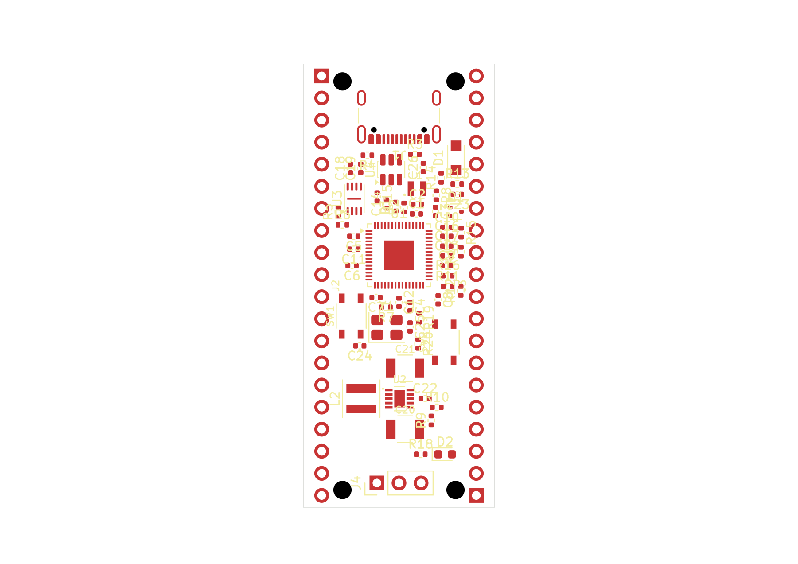
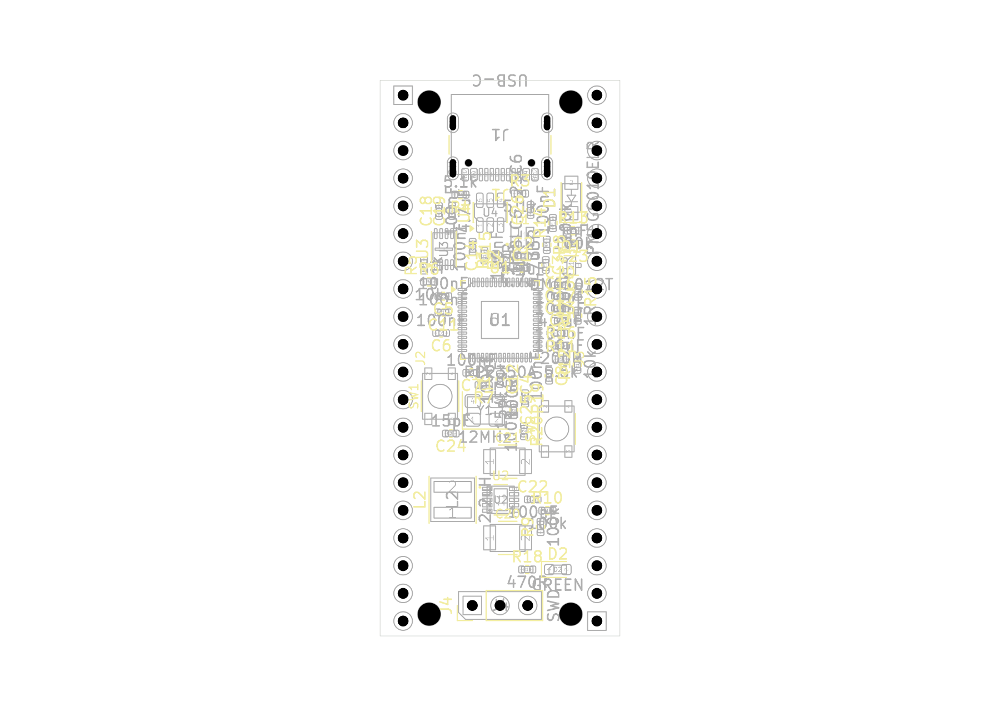

# Native V9 placement and workflow proof

**Historical, unrouted 22 x 51 mm V9 placement.** This packet preserves an actual
native placement/save/readback and normal-close result for project
`d9435dc1-27b9-4fff-8af6-f6a2cfe897e8`, captured through session26 on
18 September 2026. It is toolbox workflow qualification, **not an accepted PCB
design or a manufacturing release**.

These are the old V9 poses. They do not satisfy the newer placement intent under
the header-side constraint. The separate 60 mm board layout and routing rework
remain pending; this packet does not represent that newer candidate.

## What is included

| Saved PCB inventory | Count |
| --- | ---: |
| Electrical component footprints | 62 |
| Board-only mounting-hole footprints | 4 |
| Total footprints | 66 |
| Physical pad primitives / logical terminals | 281 / 262 |
| Copper primitives / anonymous paste primitives | 265 / 10 |
| NPTH bores, including J1's two locators | 6 |
| Tracks / ordinary routed vias / zones | 0 / 0 / 0 |

The six authored KiCad files are copied byte-for-byte:

- [PCB](project/rp2350-pico.kicad_pcb), [schematic](project/rp2350-pico.kicad_sch),
  [project settings](project/rp2350-pico.kicad_pro), and
  [custom rules](project/rp2350-pico.kicad_dru).
- [Footprint library table](project/fp-lib-table) and
  [symbol library table](project/sym-lib-table).

The [independent placement report](evidence/verification-result-host16-02.json)
passes its stated scope: saved poses, complete physical source-library geometry,
board features, the supplied host save receipt, and selected public native pad
readbacks. It does not independently replay a private native snapshot or establish
clearance, copper connectivity, plane fill, impedance or electrical suitability.

The [public close response](evidence/normal-close-response.json) records `closed`
with design acceptance not implied. The
[post-close verification](evidence/v9-normal-close-verification-01.json) records
matching authored-file hashes and no remaining lease, unsafe marker or editor
lock paths at its observation time. These scoped successes do not erase earlier
failed sessions or qualify a different placement revision.

## Actual native previews

Top view from session26, retained without image edits. The PCB is unrouted; the
visible copper belongs to pads. Reference labels remain crowded and overlapping.

Assembly view from the same session. **Label overlaps and assembly text outside
the board remain unresolved.** This is an inspection record, not a finished
assembly drawing.

## Identity and portability limits

[manifest.json](manifest.json) records the explicit eleven-file copy allowlist,
original source paths, sizes and SHA-256 values, with matching before/copy/after
bytes. The PCB is 251,637 bytes with SHA-256
`0f7df58b79c3169b689b4f4ec230791cb414db4b6f981d3aa695221ed1aff531`;
the schematic is 221,590 bytes with SHA-256
`2c3f0e5ec3bbc5379c39118fa4530a1bb816dcb4370d02814b36921a6e9ed110`.

The native files and JSON receipts preserve their originating Windows paths.
Both library tables point the custom `EvlEDA_Pico2350` library to
`C:/Users/kidch/Documents/EvlEDA-Transfer-2026-09-09/evleda/resources/pcb-libraries/rp2350-pico/v4/`.
Stock tables use `${KICAD10_SYMBOL_DIR}` and `${KICAD10_FOOTPRINT_DIR}`;
footprint model references may use `${KICAD10_3DMODEL_DIR}`. No blanket repathing
or native-source redaction was performed.

Host profiles, runtimes, libraries and the original large source-plan inputs
are not packaged here. The copied independent report retains their original
identities and paths; a full independent replay requires those pinned inputs.
This directory is not a portable installation or a resumable managed workspace.
No PRL, lock, lease/checkpoint authority, session credentials, private child logs
or runtime files were copied. The selected JSON records were inspected before
copying; no credential-like fields or values were found.

Only this new delivery directory was written. The closed native project and
earlier evidence remain unchanged. No native operation, rule change, commit or
GitHub publication was performed while assembling this packet.
