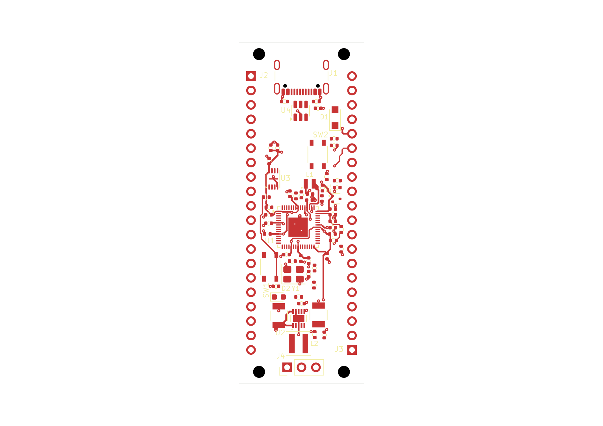

# RP2350 candidate 60-06: partial power and support routing

The approved **22 × 60 mm, two-layer board** now contains **319 trace segments,
58 vias and no zones**, saved and normally closed after routing batches 1–10.
GPIO pitch remains 2.54 mm and row spacing 17.78 mm. **The board is unfinished.**

Open the [project](native/rp2350-pico.kicad_pro),
[PCB](native/rp2350-pico.kicad_pcb), or
[schematic](native/rp2350-pico.kicad_sch). All six native files are exact copies.
Library tables retain the approved package's absolute Windows paths; this is a
design snapshot, not a portable library installation or resumable allocation.

[Top SVG](previews/board-top.svg) · [Assembly PNG](previews/board-assembly.png) ·
[Assembly SVG](previews/board-assembly.svg) · [Bottom PNG](previews/native-bottom.png) ·
[Bottom SVG](previews/native-bottom.svg)

Top and assembly are original public-tool exports. Top omits B.Cu. Bottom is a
separate read-only KiCad CLI export, rasterized on white. All views were inspected;
the six authored source files remained unchanged through checks, previews and close.

## Added copper and placement

Relative to [60-05](../native-ground-routing-60-05/README.md), eight batches add
**227 segments and 20 vias** for 1V1, 3V3, local 3V3_EN, ADC_AVDD, ADC_VREF,
BOOT_SW and CORE_LX. Each mutation used a fresh selection, mandatory native Save
and fresh saved-state readback. Exact nanometre geometry matches the
[ten-batch prefix](evidence/route-plan-through-10.json); non-routing source and
the other five authored files were preserved. Individual receipts are linked by
the [batch journal](evidence/route-batches-3-10.jsonl).

The 66 footprints retain the independently verified 60-05 placement, including
281 physical pad members and 53 drilled members. The
[placement-intent map](../placement-intent-60-03.md) explains the functional
grouping; 60-05 records the selected SW2, R5, R7 and C12 refinements. The later
R9/R10, EN/VSYS and R15 experiments remain unselected. No component was moved in
this routing session, and the full EN connection remains unfinished.

## Verification and open findings

| Check | Saved-board result |
|---|---|
| ERC | Zero configured findings. |
| DRC | **FAIL:** 135 unconnected errors, 34 dangling-via warnings, nine dangling-track warnings. |
| Clearance/courtyard/parity | No such findings reported in the configured DRC run. |
| GPIO service strips | Clear on both faces; complete saved-source audit, zero violations or unknowns. |
| Turn measurements | 232 sequential turns; four numerical false flags diagnosed below; four junctions remain unresolved. |
| Visual QA | Eight warnings and six informational rows retained; unchanged from 60-05. |

The [service-strip audit](evidence/header-service-strip-audit.json) covers
x0–3.46 and x18.54–22 mm for the full board height. Only exact pad-specific
inward leads are permitted; eleven current leads use those permissions.
Unrelated tracks, vias and ground copper receive no exemption. This verifies
the current source geometry, not immunity to soldering damage.

The [native checks](evidence/native-checks.json) retain the original results.
DRC ignores `missing_courtyard`, `track_not_centered_on_via`,
`tuning_profile_track_geometries`, `footprint_filters_mismatch`, and
`footprint_type_mismatch`; this is not unrestricted checker coverage. The public
DRC summary has complete counts but only eight of 178 rows. Its locally retained
private diagnostic is `native-check-run_drc-8a4a6332-5548-449f-8450-655170642148.json`,
SHA-256 `61ad26f77c18204b50710b34646de30e6eee039459a68bf3171bab7afe367f79`.
The private wrapper is not published. Visual warnings and their source-bound
explanation remain in [triage](evidence/visual-qa-source-triage.json).

The frozen native host reported four straight joins as turns of approximately
0.00000085–0.00000148 degrees. Exact integer-nanometre cross/dot products prove
all four are straight; see [diagnosis](evidence/turn-numerical-diagnosis.json).
The source fix uses a stable `atan2` calculation and preserves the 0.0000001-degree
tolerance. [Reanalysis of the same saved board](evidence/turn-angle-fix-comparison.json)
removes those four flags while retaining all four unresolved junctions unchanged.
**The correction is tested working source, not a replacement deployed into host20.**
The original native report remains intact.

The unresolved joins are F.Cu 3V3 at (10.4,29.05) and (15.5,37.14), B.Cu GND
at (13.39,27.74), and B.Cu 1V1 at (11.9,30.325). They are not counted as complete
bend-rule coverage. General ampacity, impedance and fabrication checks remain
unverified. Ground fill, remaining routing (including EN and RUN), return paths,
functional labels and final native verification remain open. The intrinsic USB
pad-to-NPTH source finding remains unwaived.

The angle-fix tests reproduced all four failures before the fix. Afterward,
64 of 65 selected tests passed; the remaining unchanged workflow test cannot
open its missing `reference-designs/robotics-controller-v0/robotics-controller-v0.kicad_pcb`
fixture. No substitute was supplied. Backend/UI typechecks and isolated backend
compilation passed; the full package build was not rerun. See
[code verification](evidence/code-verification.json).

## Saved identity

- PCB: 311,097 bytes; SHA-256 `925932668345459d30820625d8be202f99ec71c7ad6d7f34f6f5fb9cb6244205`.
- Schematic: SHA-256 `fd5f6e9cfbe046d2a1ce35ad8d17723405e727a5e7e89ffe8493fb1474e5b0eb`.
- Native allocation: `b2e1adba-cf6c-4ccf-a51f-00f63320d6eb`.
- Checkpoint: `1d45dd5a5af111c336e7a90ed6284e861fb96e19908e5ebb8426d0413d55396d`.

[Normal close](evidence/normal-close-proof.json) matched all six source files and
left no project lease, editor lock or unsafe marker. Client shutdown confirmed
an idle workspace. This establishes saved progress, not design acceptance.
