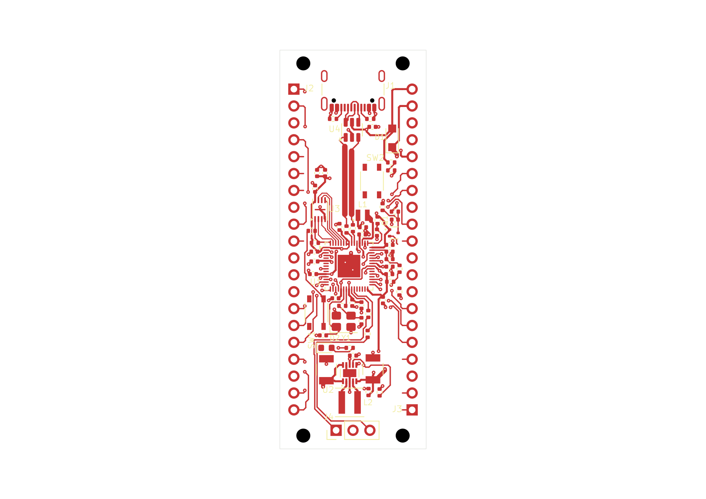

# RP2350 candidate 60-09: frozen route plan applied

This normally closed **22 × 60 mm, two-layer** candidate contains **797 track
segments, 104 vias and no zones**. All 68 batches of the frozen plan are applied.
Native endpoint checks report **53 connected nets and 14 disconnected nets**.
**The board is unfinished.** Completing this partial plan is not complete routing.

Open the [project](native/rp2350-pico.kicad_pro), [PCB](native/rp2350-pico.kicad_pcb)
or [schematic](native/rp2350-pico.kicad_sch). All six native files are exact byte
copies. Library tables retain approved absolute Windows paths; this snapshot
does not install those libraries or recreate a managed EvlEDA allocation.

[Top SVG](previews/board-top.svg) · [Assembly PNG](previews/board-assembly.png) ·
[Assembly SVG](previews/board-assembly.svg) · [Bottom PNG](previews/native-bottom.png) ·
[Bottom SVG](previews/native-bottom.svg) · [Header pinout](../pinout-60mm.md)

Top and assembly are public-tool native exports. Top omits B.Cu; bottom is a
separate read-only KiCad CLI export. All three views were inspected. Placement
retains 66 footprints, 281 physical pad members and the original 2.54 mm GPIO
pitch / 17.78 mm row spacing. Functional silkscreen labels remain unfinished.

## Routing and checks

Eighteen batches add 167 segments and eight vias to [60-08](../native-signal-routing-60-08/README.md).
Each used a fresh route selection, mandatory native Save and saved-state readback.
The saved geometry matches the [applied plan](evidence/applied-route-plan.json)
in exact integer nanometres. The [batch journal](evidence/route-batches-51-68.jsonl)
retains the operation receipts. Non-routing PCB content and the other five
native files were preserved.

| Check | Result |
| --- | --- |
| Configured ERC | Zero findings. |
| Configured DRC | **FAIL:** 66 unconnected errors, 36 dangling-via warnings, 19 dangling-track warnings. |
| Clearance/courtyard/parity | No such findings reported by this configured run. |
| GPIO service strips | Complete saved-source audit: zero violations and zero unknowns. |
| Sequential trace turns | 598 measured; one 135-degree direction-change flag at the USB protection-output pad. |
| Junction coverage | Eight unresolved junctions. |
| USB interface | Channel copper checks pass; both line-side resistor pads exceed the declared 2 mm placement bound. |
| Visual QA | Eight warnings and six informational findings, unchanged from 60-08. |

The [native endpoint report](evidence/endpoint-connectivity-report.json) covers
all 67 functional nets. All eligible physical members are reachable on the 53
connected nets. Still disconnected: **3V3_EN, GND, GPIO16, GPIO17, GPIO18, GPIO22,
GPIO24_VBUS_SENSE, GPIO26, GPIO29_VSYS_SENSE, GPIO3, GPIO4, GPIO5, GPIO7 and RUN**.
Native reachability does not establish plane contact, absence of shorts,
electrical timing, impedance or ampacity.

The [service-strip audit](evidence/header-service-strip-audit.json) covers
x0–3.46 and x18.54–22 mm for the full height on both faces. Only exact pad-specific
inward leads are permitted; 39 tracks use those permissions. Unrelated ground
copper receives no exemption. This checks the saved geometry, not resistance
to future soldering damage.

DRC ignores `missing_courtyard`, `track_not_centered_on_via`,
`tuning_profile_track_geometries`, `footprint_filters_mismatch`, and
`footprint_type_mismatch`. The [native checks](evidence/native-checks.json)
retain exclusions and complete counts; the public DRC summary returns eight
of 121 finding rows. Full private diagnostics remain local with their identities
in the public receipts.

The [branch review](evidence/branch-site-review.json) locates the angle flag at
U4.6, USB_DP_PORT, F.Cu (9.9, 10.8625). Source topology recognizes the declared
protection-output fork, but the literal flag and eight unresolved junctions
remain explicit. Five unresolved junctions coincide exactly with pad/via
centres; this does not establish their full copper geometry or waive the turn policy.

The [interface response](evidence/plane-and-interface-response.json) reports
passing channel topology, source polarity, width, minimum gap, length, skew,
stubs, uncoupled length and transitions. Aggregate topology/geometry/termination
still fail: R1.2 is approximately **2.684 mm**, and R2.2 **2.768 mm**, from their
source endpoints against the bound 2 mm limit. Impedance and fresh reference
coverage remain unqualified. The bound was not changed to hide these failures.

## Ground plane and remaining work

No plane fill was attempted. A [receipt-size estimate](evidence/plane-receipt-size-estimate.json)
found that repeated PCB strings and raw PAD responses could exceed the unchanged
8 MiB native-stage artifact limit. This is an estimate, not an observed fill
failure. Lossless evidence compaction needs implementation and qualification
before using the plane operation on this board.

Remaining work includes the disconnected signal/control nets, USB resistor
placement and angle/junction findings, fresh ground fill and return-path checks,
functional labels, final DRC and electrical/DFM review. The intrinsic USB
pad-to-NPTH source finding remains unwaived. See the [placement intent](../placement-intent-60-03.md)
and retained [visual-QA triage](evidence/visual-qa-source-triage.json).

PCB: 393,431 bytes, SHA-256
`549e054104125fc48c5d1417e9d6ea948c81f1a3bcfda1e4e2b04bc9161afa8b`.
Native allocation: `b2e1adba-cf6c-4ccf-a51f-00f63320d6eb`.
Checkpoint: `f1405017b10462b2cdeca52a80fa847a1f3ada0483301c7df818b792dc59b077`.
All six sources matched through checks, previews and [normal close](evidence/normal-close-proof.json).
No lease, editor lock or unsafe marker remained. Client shutdown confirmed an
idle workspace. This is a saved candidate, not functional or manufacturing acceptance.
