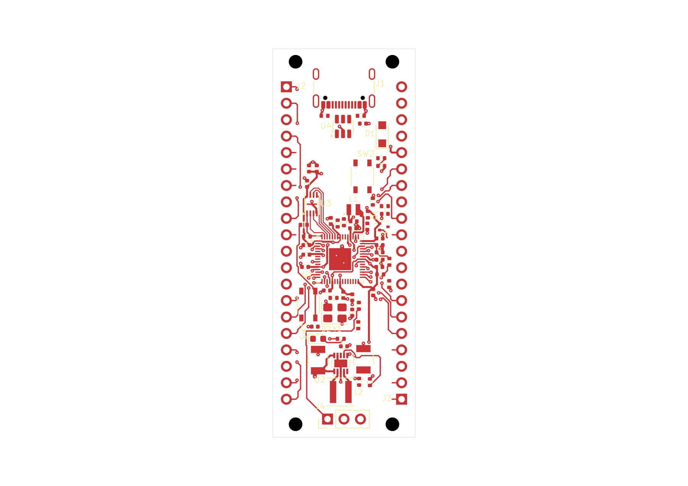

# RP2350 candidate 60-08: partial signal routing

This normally closed **22 × 60 mm, two-layer** snapshot has **630 segments,
96 vias and no zones**. Native endpoint checks report **35 connected nets and
32 disconnected nets**. **The board remains unfinished.** GPIO pitch is 2.54 mm
and row spacing is 17.78 mm.

Open the [project](native/rp2350-pico.kicad_pro), [PCB](native/rp2350-pico.kicad_pcb),
or [schematic](native/rp2350-pico.kicad_sch). All six native files are exact byte
copies. Library tables retain approved absolute Windows paths; this snapshot
is not a portable library installation or a resumable EvlEDA allocation.

[Top SVG](previews/board-top.svg) · [Assembly PNG](previews/board-assembly.png) ·
[Assembly SVG](previews/board-assembly.svg) · [Bottom PNG](previews/native-bottom.png) ·
[Bottom SVG](previews/native-bottom.svg) · [Header pinout](../pinout-60mm.md)

Top and assembly are original public-tool exports. Top omits B.Cu. Bottom is a
separate read-only KiCad CLI export, rasterized on white. All three views were
inspected; quantitative findings below come from separate checks.

## Added routes and connectivity

Twenty batches add **118 segments and nine vias** to
[60-07](../native-gpio-routing-60-07/README.md). Each used a fresh route selection,
mandatory native Save and fresh saved-state readback. The entire saved geometry
matches the [applied plan prefix](evidence/route-plan-through-50.json) in exact
integer nanometres. The [batch journal](evidence/route-batches-31-50.jsonl) links
the receipts. Non-routing PCB content and the other five native files were preserved.

The [native endpoint report](evidence/endpoint-connectivity-report.json) covers
all 67 functional nets. Fifteen additional nets are connected, with every
eligible physical member reachable:

- GPIO6, GPIO8, GPIO9, GPIO27 and GPIO28.
- LED_A, QSPI_CS, QSPI_SCLK and QSPI_SD0–QSPI_SD3.
- RT_LX1, RT_LX2 and SWCLK_HDR.

The 20 previously connected nets remain connected. The 32 disconnected nets
include GND, RUN, 3V3_EN, remaining GPIO/sensing connections and the not-yet-applied
power, USB, crystal and debug routes. Component-internal conduction is not inferred.
Native reachability does not establish intended-plane contact, fresh fill,
absence of shorts, timing, impedance or ampacity.

The complete native observation covers 1,303,119 bytes, identity
`a3d9a397a5bb1508613c2b5a4a1a6355a27a8121e52d2f28a4aa813f81e1f511`.
The full host-private assessment remains local; its public diagnostic identity
is retained in the endpoint response.

## Clearance, service strips and turns

| Check | Result |
| --- | --- |
| Configured ERC | Zero findings. |
| Configured DRC | **FAIL:** 102 unconnected errors, 36 dangling-via warnings, 19 dangling-track warnings. |
| Clearance/courtyard/parity | No such findings reported by this configured DRC run. |
| GPIO service strips | Complete saved-source audit: zero violations and zero unknowns. |
| Sequential trace turns | 465 measured; corrected source analysis reports zero violations. |
| Junction coverage | Four existing branch junctions remain unresolved. |
| Visual QA | Eight warnings and six informational findings, unchanged from 60-07. |

The [strip audit](evidence/header-service-strip-audit.json) covers x0–3.46 and
x18.54–22 mm for the full board height on both faces. Only exact pad-specific
inward leads are permitted; 37 tracks use those permissions. Unrelated ground
copper receives no exemption. This establishes saved geometry, not immunity to
soldering abuse or compliance of future copper.

DRC ignores `missing_courtyard`, `track_not_centered_on_via`,
`tuning_profile_track_geometries`, `footprint_filters_mismatch`, and
`footprint_type_mismatch`. ERC exclusions also remain in the
[native checks](evidence/native-checks.json). The public DRC summary preserves
complete counts but returns only eight of 157 finding rows. The full private
DRC diagnostic remains local, identity
`25e066194f9617804e8b8ace9dd33ce3939629e258e9eca976f5398792e2076e`.

The frozen native host still reports four previously diagnosed numerical angle
false flags. The [turn review](evidence/turn-review.json) proves each exactly
straight with integer cross/dot products and reanalyzes this same saved board
with the tested angle fix. The 0.0000001-degree tolerance is unchanged; the fix
was not deployed into this native session. Branches at F.Cu (10.4,29.05),
F.Cu (15.5,37.14), B.Cu (13.39,27.74), and B.Cu (11.9,30.325) remain unresolved.

Placement retains 66 footprints, 281 physical pad members and 53 footprint
drilled members. See the [placement intent](../placement-intent-60-03.md),
[60-05 refinements](../native-ground-routing-60-05/README.md), and preserved
[visual-QA triage](evidence/visual-qa-source-triage.json). Alternative placement
studies are unselected. Functional labels and final silkscreen legibility remain unfinished.

## Saved identity and remaining work

- PCB: 365,943 bytes; SHA-256 `70314bc44da7f9b496c4d1b549bcf93a4c3659876a06924623b3da6bfc2c890c`.
- Schematic: SHA-256 `fd5f6e9cfbe046d2a1ce35ad8d17723405e727a5e7e89ffe8493fb1474e5b0eb`.
- Native allocation: `b2e1adba-cf6c-4ccf-a51f-00f63320d6eb`.
- Checkpoint: `75fb787b45ba1c8a1f11d1e3825b3b2400e9f2db62ea6a7334dd69ac1335acb0`.

All six sources matched through checks, previews and
[normal close](evidence/normal-close-proof.json). No project lease, editor lock
or unsafe marker remained; client shutdown confirmed an idle workspace.

Remaining work includes batches 51–68, the still-open signal/control routes,
ground fill and return-path checks, labels, branch-junction review and final
native verification. The intrinsic USB pad-to-NPTH source finding remains
unwaived. This milestone records progress, not functional or manufacturing acceptance.
