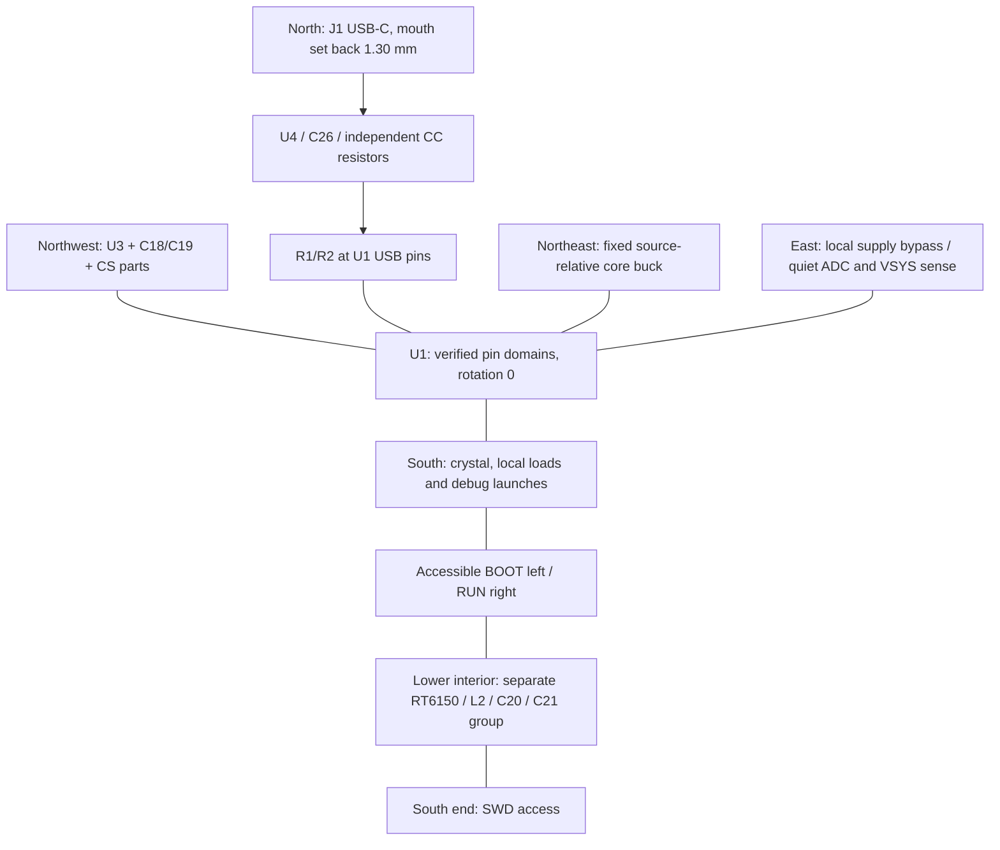

# RP2350 placement and routing input proposal

This proposal supplies **62 front-side target poses with bounded functional regions, 65 bounded routing records and four board-only mounting bores**. The selected footprints pass the source-geometry courtyard packing screen at the target poses. A complete four-net USB proposal also passes the source channel checks and selected-pad/drill clearance checks at the revised R2/U4 targets. **Native route application, DRC and reference/impedance verification remain pending.**

The companion [placement-constraints.json](placement-constraints.json) contains the exact V2-shaped fields under `v2Patch`, physical pad-centre observations, source identities and geometry/budget checks. `netClassAssignments` is a merge instruction for each existing net's `netClassId`, not an extra V2 root field. The original circuit, draft and earlier placement-intent files remain unchanged. Coordinates here supersede the earlier illustrative positions; the old floorplan image is historical.

## Read first: the arrangement and the changes that make it fit

- U1 remains `(10.50,22.00)`, rotation 0: USB/QSPI/core pins north, analog east, crystal/debug south. The source-relative L1/C1/C2/R8/C3 core group stays intact as a position proposal.
- J1 remains the selected GCT USB4105 at `(10.50,4.975)`, rotation 180, giving a **1.30 mm mouth setback** without changing its lands. This is an explicit design departure from the drawing's suggested edge line, with cable/body tolerance conditions below.
- The four bare bores now use **x=4.00/17.00, y=2.00/49.00**, a project-defined **13 x 47 mm pattern**. The header grid stays unchanged; the mounting width deliberately differs from the Pico reference's 11.4 mm.
- U4's current target is `(9.60,12.15)`, +90, **0.25 mm south of the preceding target and inside its unchanged region**. This creates room for the complete Type-C fan-in: two positive branches at U4.6 and a negative tie above the connector contact row. CC resistors and C26 follow actual connector/ESD pins. R1/R2 remain directly at U1's USB pads.
- **Route-aware revision:** R2 moves from y=16.90 to **16.70**, retaining x=11.085 and +90. The old pose passed courtyard packing but its rounded pad copper trapped the permitted D+ launch. The new two launches satisfy the 45-degree, clearance and 3 mm budgets against all selected source pads/drills. R1 stays at `(10.125,16.900)`. [Exact evidence and pending full-channel plan](usb-route-plan.json).
- U3 rotates +90 at `(6.50,15.50)`, with C18/C19 above its actual VCC8 pin. Its courtyard now ends at x=7.75; L1 begins at x=11.40, leaving a **3.65 mm transverse opening** for the USB approach before the local decoupler/resistor row. The USB proposal reserves a 2.40 mm body lane. This packing observation does not prove the complete routed corridor.
- BOOT moves to the lower-left at `(5.00,29.00)`, +90, so it does not displace flash decoupling. R5 remains beside flash CS; the longer button-side branch is after the 1 kohm resistor. RUN remains accessible on the lower-right. The crystal/load group occupies the quiet space between them and U1.
- The physically larger RT6150/L2/1210 group occupies the lower interior. Its two LX paths, input/output capacitors and feedback sensing remain a local circuit. The longer VSYS feed is a DC distribution tradeoff, not permission to lengthen switching loops.

The diagram shows functional relationships only. It contains no routed copper. A +90/180/270-degree **whole-package orientation does not permit 90-degree trace corners**: all copper retains maximum 45-degree turns, no acute corners, no backtracking and no self-intersections.

## Mechanical anchors and what the software fields mean

Coordinates are millimetres from the northwest corner of a 21 x 51 mm board, +X east and +Y south, viewed from the component side. KiCad +90 maps local +Y to board +X. Every component retains its intentional cardinal orientation. **Only J1-J4 are exact-point electrical placement constraints; the four mounting features also remain fixed.** Other components have modest functional regions for normal route-aware adjustment. The listed targets are preferred starting poses, not false mechanical requirements.

| Region group | Allowed origin region / displacement | Purpose |
| --- | --- | --- |
| U1 | x=10.40..10.60, y=22.00..22.15 | Small core adjustment, biased away from the newly opened USB launch corridor. |
| U3 | x=6.20..6.80, y=15.15..15.65 | Local QSPI/decoupling escape adjustment. |
| U4 | x=9.30..9.80, y=11.90..12.15 | Connector-to-ESD adjustment within the north group. |
| R1 | x=10.00..10.25, y=16.60..16.95 | MCU D+ launch and pair approach. |
| R2 | x=10.985..11.185, y=16.45..16.70 | D- launch with the obstructing old y=16.90 excluded. |
| L1/C1/C2/C3/R8 | +/-0.15 in X/Y around targets | Preserve the preferred U1-relative core arrangement while permitting small verified copper/land adjustments. |
| C14/C15 | +/-0.15 X, +/-0.20 Y | Keep separate USB/QSPI supply bypasses in the local north bank. |
| U2/L2/C20/C21 | +/-0.35 X, +/-0.40 Y | Local regulator-loop and larger-land adjustment. |
| SW1/SW2 | +/-0.35 X/Y | Retain accessible control regions. |
| D1 | x=17.02..17.09, y=10.50..10.80 | Tight corridor between the USB and right contact row. |
| C26 | x=12.20..12.60, y=10.35..10.90 | Local ESD supply return arrangement. |
| Remaining non-connectors | +/-0.25 X, +/-0.30 Y | Small pin-local adjustment, not unrestricted board placement. |

The component-to-component and board-edge clearances remain independent constraints. **Not every combination of points inside these boxes is necessarily legal or routable.** Choose actual poses together, recheck clearances and routes, and retain the core/decoupling/analog return intent. The source geometry passes reported below apply to the listed target poses, not every permitted point. No wider copper, shorter return, or successful routing claim follows from a region alone.

J2 pad n is `(1.61,1.37+2.54*(n-1))`; J3 pad n is `(19.39,49.63-2.54*(n-1))`. Thus local J2.1..20 means Pico1..20 downward, while J3.1..20 means Pico21..40 upward. Row spacing is 17.78 mm. The selected v3 bare PTH contacts are unpopulated copper/bores, not a fitted plastic header or castellated module claim.

The inspected placement evaluator compares **transformed courtyard bounds**, not footprint origins or copper, with the outline. `regionMm` bounds the origin only. `edgePreference` means the closest courtyard edge; it does not express the direction in which a connector mates. The bare-row end margin is 0.27 mm and side margin 0.51 mm, so J2 uses `top` and J3 `bottom` as literal nearest-edge preferences. Their left/right row positions and numbering are separately fixed above. J4 uses `bottom`; J1 uses `top`.

The former stock-header courtyard overrun was a mismatch with the implemented V1 placement rule, not proof that an intentional assembly envelope outside a PCB is physically impossible. The V2 model guide references those semantics, while the current plane common checker explicitly lists placement as not evaluated. **No V2 placement evaluation pass is claimed.** The revised bare-row selection and recessed J1 target now also pass the conservative courtyard-to-board screen, so no negative edge clearance, shrunken stock courtyard or copper-rule waiver was introduced.

Electrical footprints use minimum courtyard-to-outline clearance 0.25 mm, with J1 requiring 0.50 mm. Additional courtyard-to-courtyard separation is 0.10 mm generally. The explicitly listed compact core/north cluster and nearby R14/D1 use 0.01 mm **beyond the source footprint's own courtyard**; their checked target poses preserve positive separation. This is not a 0.01 mm copper clearance. All ordinary copper uses at least 0.15 mm clearance; the USB class uses 0.20 mm. Source courtyard envelopes already include their own process allowances; selected-part assembly qualification remains separate.

### Four bores, separate from the BOM

The new source schema can represent these as `boardFeatures`, not electrical components or schematic symbols. The v4 asset is `EvlEDA_Pico2350:MountingHole_D2.1_Pico`: one centred circular 2.1 mm NPTH, no number/net, no inferred screw-head/body courtyard, and explicit board-only/BOM/position-file exclusion. Root must bind the complete v4 package and recapture its policy-dependent library inspection identities; the existing v3 electrical selections remain historical source evidence.

| Feature | Centre X,Y | Basis |
| --- | --- | --- |
| H1 | 4.00,2.00 | Explicit outward-column project choice; the 2.00 mm upper inset follows the reference. |
| H2 | 17.00,2.00 | Same 13 mm-wide project pattern. |
| H3 | 4.00,49.00 | Explicit **symmetric project choice**, 2.00 mm from the lower edge. The supplied figure does not separately dimension this lower-hole Y. |
| H4 | 17.00,49.00 | Same 13 x 47 mm project pattern. |

Pico 2's text specifies four 2.1 mm bores with +/-0.05 mm diameter tolerance. Its illustrated columns are x=4.8/16.2, giving 11.4 mm horizontal pitch. **Those columns are superseded here by x=4/17 and 13 mm pitch** to resolve the connector-courtyard interference without altering its footprint or waiving a rule. The figure's lower 2.4 and 1.6 dimensions describe SWD contact geometry, not authority for a lower-hole coordinate of 48.6 or49.4 mm. This is a Pico-header-compatible candidate with a different mounting pattern, not a carrier/fastener drop-in claim. Bounds remain hole-to-copper >=0.25 mm and hole-to-edge >=0.50 mm. Nominal 2.1 mm bores remain the bound CAD geometry; maximum 2.15 mm diameter is separately screened.

At J1's unchanged pose the front shield centres remain `(6.18,3.90)` and `(14.82,3.90)`. With the current outward bore columns, exact nominal capsule-to-circle geometry gives **1.096205 mm shield-copper-to-bore** and **1.296205 mm shield-drill-to-bore** gaps. Maximum bore diameter reduces those by0.025 mm. The closest selected pad bounding boxes are now the main-header end pads: the conservative maximum-bore-to-pad-box gap is **0.465 mm at all four bores**. This screen includes all selected pad locations; future copper, position tolerances and actual native DRC remain separate evidence.

The outward columns also increase the nominal shell-to-maximum-bore margin to0.955 mm; applying only the GCT B3 default width tolerance leaves **0.880 mm before position/assembly tolerances**. The earlier 0.080 mm result applied to the superseded x=4.8/16.2 columns. The drawing's minimum 1.85 mm overmold shoulder distance minus the1.30 mm setback still leaves0.55 mm longitudinal margin before board-edge/placement tolerances and the plug's Z envelope. Cable, shell/peg/body, hole-location and selected fastener dimensions remain physical-fit work. See [usb-connector-fit.md](usb-connector-fit.md). These are bare bores; an unselected M2 head or washer is not silently treated as a required courtyard.

The old-column native screen found two `npth_inside_courtyard` errors at J1, despite satisfactory copper gaps. The final independent screen, using the **canonical net classes, current U4 target and outward bores**, has zero targeted copper/hole/edge/courtyard physical-placement findings. Its source readback retains all66 footprints,281 physical pads,262 logical assignments and65 nets. **124 silk-overlap warnings,114 silk-over-copper warnings and194 unrouted connection items remain; this is not a global DRC pass.** The final fixture contains no tracks or zones. Candidate03/04 input snapshots and the final baseline receipt remain in the external evidence directories; the JSON pins that receipt and verifies its evaluated input arrays match this proposal.

## Every component has a concrete pose

All are front side. The table is generated from the checked JSON, and every reference occurs exactly once. Read it with the group rationale in [placement-intent.md](placement-intent.md) and the changed-group explanations above; neither the old visual nor old illustrative coordinates overrides this table.

| Ref | X | Y | Rotation |
| --- | --- | --- | --- |
| U1 | 10.5 | 22 | 0 |
| U2 | 10.65 | 38.5 | 0 |
| U3 | 6.5 | 15.5 | 90 |
| U4 | 9.6 | 12.15 | 90 |
| J1 | 10.5 | 4.975 | 180 |
| J2 | 1.61 | 1.37 | 0 |
| J3 | 19.39 | 49.63 | 180 |
| J4 | 7.96 | 48.2 | 90 |
| L1 | 12.5 | 14.8 | 0 |
| L2 | 6.15 | 38.5 | 90 |
| Q1 | 16.85 | 17 | 0 |
| D1 | 17.05 | 10.8 | 90 |
| D2 | 15.8 | 44.9 | 0 |
| SW1 | 5 | 29 | 90 |
| SW2 | 15.7 | 32 | 90 |
| Y1 | 9.1 | 30.3 | 180 |
| R1 | 10.125 | 16.9 | 90 |
| R2 | 11.085 | 16.7 | 90 |
| R3 | 7.25 | 10.8 | 90 |
| R4 | 13.7 | 12.4 | 90 |
| R5 | 4 | 17.2 | 180 |
| R6 | 4 | 18.5 | 0 |
| R7 | 9.45 | 27.15 | 270 |
| R8 | 14.7 | 15.1 | 270 |
| R9 | 14.7 | 40.5 | 0 |
| R10 | 14.7 | 39.2 | 0 |
| R11 | 16 | 25.6 | 0 |
| R12 | 17.5 | 25.8 | 90 |
| R13 | 17.2 | 13.8 | 0 |
| R14 | 15.65 | 14 | 90 |
| R15 | 17.5 | 19.4 | 90 |
| R16 | 16 | 24.4 | 0 |
| R17 | 17.5 | 21.6 | 90 |
| R18 | 13 | 44.9 | 0 |
| R19 | 12.8 | 27.15 | 270 |
| R20 | 15.7 | 27.1 | 0 |
| C1 | 12.5 | 17.39 | 0 |
| C2 | 12.5 | 16.45 | 0 |
| C3 | 14.7 | 16.95 | 270 |
| C4 | 11.65 | 27.12 | 270 |
| C5 | 5.3 | 20 | 180 |
| C6 | 5.3 | 23.2 | 180 |
| C7 | 8.35 | 27.12 | 270 |
| C8 | 14 | 27.12 | 270 |
| C9 | 16 | 23.2 | 0 |
| C10 | 16 | 18.8 | 0 |
| C11 | 5.3 | 21.3 | 180 |
| C12 | 10.55 | 27.12 | 270 |
| C13 | 16 | 22.1 | 0 |
| C14 | 9.165 | 16.9 | 90 |
| C15 | 8.225 | 16.9 | 90 |
| C16 | 16 | 19.9 | 0 |
| C17 | 16 | 21 | 0 |
| C18 | 4.9 | 12.3 | 90 |
| C19 | 6.1 | 12.3 | 90 |
| C20 | 11.2 | 42 | 0 |
| C21 | 11.2 | 35 | 0 |
| C22 | 13.2 | 38.5 | 90 |
| C23 | 17.2 | 14.9 | 0 |
| C24 | 12.22 | 29 | 0 |
| C25 | 5.99 | 32.42 | 180 |
| C26 | 12.35 | 10.6 | 0 |

Capacitors remain attached to their actual supply/signal terminals: C1->U1.49; C2->U1.50/output and local PGND47; C3->U1.46; C4/C12->U1.23; C5/6/7/8/9/10->U1.1/11/20/30/38/45; C11/C13->U1.6/39; C14/C15->U1.53/54; C16/C17->U1.44; C18/C19->U3.8; C20/C21/C22->U2.5/1/8; C23->Q1.3; C24->XIN/Y1.1; C25->Y1.3; C26->U4.5. Their pose orientations put signal/supply ends toward those circuits where possible; ground must still receive short, deliberately authored local returns.

C1/C2/R8/C3 use the selected stock 0402 lands, whose pad centres differ from the original Minimal footprints. Keeping the recorded component-centre offsets preserves intent, **not a copied/validated regulator copper layout**. L1 retains the actual selected Minimal land variant and marked pad1=1V1, pad2=CORE_LX. C4 stays at DVDD23 away from L1. U2/L2 orientation aligns LX1 with L2 pad1 and LX2 with pad2; C21 senses FB from its positive node, with the switch-current returns kept out of analog/crystal ground paths.

The narrowest courtyard separations are deliberate local packings near the U1 north edge. Preserve their function during text cleanup and copper authoring rather than moving capacitors into a distant bank. Any actual pose change inside its functional region still requires fresh copper/courtyard checks. Fields/silkscreen are not part of this bounding-box screen; the stock J1 Value field, for example, needs normal later field placement.

## Routing constraints are chosen design budgets

All 65 nets have topology, layer, via count, length bound and reference-path disposition. These are routing goals derived from the board geometry and intended circuit, **not measured trace lengths or claimed manufacturer maxima**. Every net with two logical endpoints uses `point_to_point`; larger trace nets use `tree`; GND explicitly uses `plane` with bounded access routing. No route is left unbounded.

| Class | Minimum/default width | Clearance | Copper-to-edge | Layers and rationale |
| --- | --- | --- | --- | --- |
| SIGNAL | 0.20 | 0.15 | 0.25 | F.Cu/B.Cu allowed at class level; individual short/quiet routes bind F.Cu. The route API's explicit-width floor is 0.20 mm. |
| POWER | 0.30 | 0.15 | 0.25 | VBUS/VSYS on F.Cu/B.Cu. Widen distribution bodies where space permits and verify voltage loss/heating. |
| POWER_FINE | 0.20 | 0.15 | 0.25 | 1V1/3V3 fine terminal access. The actual route plan permits at most 1 mm at U1.50/U1.53, retains >=0.30 mm elsewhere and widens backbones/loops. |
| SWITCH | 0.30 | 0.15 | 0.25 | F.Cu only, zero vias, each LX net <=8 mm. The short escape width is not an ampacity or thermal rating. |
| GROUND | 0.30 | 0.15 | 0.25 | Plane plus short accesses; actual ground-contact/EP paths require separate evidence. |
| USB_FS | 0.82 | 0.20 | 0.50 | F.Cu only. All four member classes must default to the body interval under the current interface schema. Narrower 0.20/0.40/0.60 mm sections are authorized only by the USB proposal's explicit terminal-bound escapes. |

The shared via policy is **64 total**, 0.60 mm diameter, 0.25 mm drill and minimum 0.15 mm annular ring. The *sum* of per-net maxima is exactly 64, as required by the V2 schema: GND access32; the 26 exposed GPIO nets1 each; 1V1/3V3 two each; VBUS/VSYS one each. Other routes use zero vias. For a GPIO, one via permits a F.Cu-to-B.Cu branch ending at its through-hole header pad; it is not a general two-via crossover allowance. If routing requires more, revise the explicit allocation rather than silently exceeding it. The finite 32-via ground budget must accommodate EP grounds and local return groups; its sufficiency is a routing check, not established by a counter alone.

All copper uses mitered 45-degree routing, maximum turn45 and minimum straight-before-turn0.10 mm. The latter is a chosen small geometry bound suitable for fine-pitch escapes, not an arbitrary 3 mm requirement or a vendor limit. It does not make a 90-degree bend acceptable.

Ground is proposed as one B.Cu plane over x=0.25..20.75/y=0.25..50.75, clearance0.15, minimum copper width0.20, solid pad connection, removal of unconnected islands below1 mm² and a single connected component requirement. Solid connection is a low-impedance input choice; it does not establish assembly solderability. No island-removal or connectivity result is claimed. Current scope is two layers: the RP2350 restriction on extra **top** copper beneath LX/L1 still needs actual copper authoring; an indiscriminate B.Cu split would undermine the USB reference.

### USB and reference continuity

The complete USB proposal remains owned by [usb-construction.json](usb-construction.json): body0.82/gap0.20, maximum body envelope1.90, reserved lane2.40, all14 signal anchors, F.Cu, no vias, explicit fan-in/ESD branches and a 0.90 mm B.Cu coverage margin beyond track edges. R1/R2 positive source pads are within2 mm of U1.52/51; their actual routed launch budgets are3 mm. Port-tree budgets are22 mm each; channel source-to-contact/skew/branch and aggregate budgets remain those of the USB artifact. Do not replace these with an invented connector internal tie or an external long protection loop.

QSPI, crystal and SWD nets also require F.Cu with zero vias, a continuous `GND_PLANE` reference, explicit actual GND terminal mappings and a chosen 0.25 mm geometric coverage margin. These margins are checkable guards, not proof of an infinite plane or SI/EMC performance. U1 signal pins map to actual GND61, U3 to VSS4, U4 to GND2, J4 to its ground2, crystal pins to case ground2 and load capacitors to their actual ground2. Passive launch endpoints use explicitly identified nearby circuit ground terminals; they are not invented internal ground pins.

Other routes explicitly use `referencePath:{mode:"none"}` in the checker. That means no formal continuous-plane coverage claim is requested for that net; it does **not** authorize omitting physical current return paths or splitting the common ground. Quiet ADC/sense and both converter returns still follow the placement intent. The exposed GPIO crossover allowance also requires avoiding the reserved USB/QSPI/clock return regions when B.Cu is used.

### Per-net budgets

The JSON retains an unobstructed Manhattan minimum-spanning-tree *screen* over every physical pad centre. For ordinary low-speed/header nets, the length bound is the next5 mm at or above `1.5 * screen + 8 mm`; specific critical groups instead use explicit short budgets below. This is not a routed obstacle solution, a proven minimum or a reason to allocate serpentine length. Actual traces should remain short. Every current pad-centre screen is within its proposed budget.

| Net | Topology | Layer | Max vias | Max total copper mm | Reference coverage |
| --- | --- | --- | --- | --- | --- |
| 1V1 | tree | either | 2 | 70 | No formal coverage claim |
| 3V3 | tree | either | 2 | 200 | No formal coverage claim |
| 3V3_EN | tree | F.Cu | 0 | 70 | No formal coverage claim |
| ADC_AVDD | tree | F.Cu | 0 | 20 | No formal coverage claim |
| ADC_VREF | tree | F.Cu | 0 | 30 | No formal coverage claim |
| BOOT_SW | tree | F.Cu | 0 | 35 | No formal coverage claim |
| CORE_LX | point_to_point | F.Cu | 0 | 8 | No formal coverage claim |
| GND | plane | F.Cu | 32 | 160 | Reference plane |
| GPIO0 | point_to_point | either | 1 | 45 | No formal coverage claim |
| GPIO1 | point_to_point | either | 1 | 45 | No formal coverage claim |
| GPIO10 | point_to_point | either | 1 | 35 | No formal coverage claim |
| GPIO11 | point_to_point | either | 1 | 35 | No formal coverage claim |
| GPIO12 | point_to_point | either | 1 | 40 | No formal coverage claim |
| GPIO13 | point_to_point | either | 1 | 45 | No formal coverage claim |
| GPIO14 | point_to_point | either | 1 | 55 | No formal coverage claim |
| GPIO15 | point_to_point | either | 1 | 60 | No formal coverage claim |
| GPIO16 | point_to_point | either | 1 | 60 | No formal coverage claim |
| GPIO17 | point_to_point | either | 1 | 55 | No formal coverage claim |
| GPIO18 | point_to_point | either | 1 | 45 | No formal coverage claim |
| GPIO19 | point_to_point | either | 1 | 40 | No formal coverage claim |
| GPIO2 | point_to_point | either | 1 | 35 | No formal coverage claim |
| GPIO20 | point_to_point | either | 1 | 35 | No formal coverage claim |
| GPIO21 | point_to_point | either | 1 | 35 | No formal coverage claim |
| GPIO22 | point_to_point | either | 1 | 25 | No formal coverage claim |
| GPIO23_SMPS_PS | tree | F.Cu | 0 | 40 | No formal coverage claim |
| GPIO24_VBUS_SENSE | tree | F.Cu | 0 | 20 | No formal coverage claim |
| GPIO25_LED | point_to_point | F.Cu | 0 | 45 | No formal coverage claim |
| GPIO26 | point_to_point | either | 1 | 25 | No formal coverage claim |
| GPIO27 | point_to_point | either | 1 | 20 | No formal coverage claim |
| GPIO28 | point_to_point | either | 1 | 25 | No formal coverage claim |
| GPIO29_VSYS_SENSE | tree | F.Cu | 0 | 18 | No formal coverage claim |
| GPIO3 | point_to_point | either | 1 | 35 | No formal coverage claim |
| GPIO4 | point_to_point | either | 1 | 30 | No formal coverage claim |
| GPIO5 | point_to_point | either | 1 | 25 | No formal coverage claim |
| GPIO6 | point_to_point | either | 1 | 20 | No formal coverage claim |
| GPIO7 | point_to_point | either | 1 | 20 | No formal coverage claim |
| GPIO8 | point_to_point | either | 1 | 25 | No formal coverage claim |
| GPIO9 | point_to_point | either | 1 | 25 | No formal coverage claim |
| LED_A | point_to_point | F.Cu | 0 | 15 | No formal coverage claim |
| QSPI_CS | tree | F.Cu | 0 | 20 | 0.25 mm guard |
| QSPI_SCLK | point_to_point | F.Cu | 0 | 16 | 0.25 mm guard |
| QSPI_SD0 | point_to_point | F.Cu | 0 | 16 | 0.25 mm guard |
| QSPI_SD1 | point_to_point | F.Cu | 0 | 16 | 0.25 mm guard |
| QSPI_SD2 | point_to_point | F.Cu | 0 | 16 | 0.25 mm guard |
| QSPI_SD3 | point_to_point | F.Cu | 0 | 16 | 0.25 mm guard |
| RT_LX1 | point_to_point | F.Cu | 0 | 8 | No formal coverage claim |
| RT_LX2 | point_to_point | F.Cu | 0 | 8 | No formal coverage claim |
| RUN | tree | F.Cu | 0 | 40 | No formal coverage claim |
| SWCLK_HDR | point_to_point | F.Cu | 0 | 45 | 0.25 mm guard |
| SWCLK_MCU | point_to_point | F.Cu | 0 | 6 | 0.25 mm guard |
| SWDIO_HDR | point_to_point | F.Cu | 0 | 45 | 0.25 mm guard |
| SWDIO_MCU | point_to_point | F.Cu | 0 | 10 | 0.25 mm guard |
| USB_CC1 | point_to_point | F.Cu | 0 | 20 | No formal coverage claim |
| USB_CC2 | point_to_point | F.Cu | 0 | 25 | No formal coverage claim |
| USB_DM_MCU | point_to_point | F.Cu | 0 | 3 | 0.9 mm guard |
| USB_DM_PORT | tree | F.Cu | 0 | 22 | 0.9 mm guard |
| USB_DP_MCU | point_to_point | F.Cu | 0 | 3 | 0.9 mm guard |
| USB_DP_PORT | tree | F.Cu | 0 | 22 | 0.9 mm guard |
| VBUS | tree | either | 1 | 80 | No formal coverage claim |
| VREG_AVDD | tree | F.Cu | 0 | 12 | No formal coverage claim |
| VSYS | tree | either | 1 | 130 | No formal coverage claim |
| VSYS_DIV | tree | F.Cu | 0 | 12 | No formal coverage claim |
| XIN | tree | F.Cu | 0 | 16 | 0.25 mm guard |
| XOUT_MCU | point_to_point | F.Cu | 0 | 5 | 0.25 mm guard |
| XTAL_OUT | tree | F.Cu | 0 | 16 | 0.25 mm guard |

The power-net lengths bound total tree copper, not maximum source-to-load impedance. Operating currents and voltage/thermal assumptions belong to [operating-constraints.json](operating-constraints.json). A 0.30 mm minimum width alone cannot demonstrate the maximum supply/current envelope; widen the bodies as appropriate and retain load, temperature and actual construction checks.

Candidate 06 adds POWER_FINE after screening every connected physical copper anchor. At the preceding 0.30 mm floor, U1.50 and U1.53 leave only 0.15 mm to adjacent USB pads, below their unchanged 0.20 mm clearance. These are the only two failing anchors among 263 checked. A 1 mm × 0.20 mm neck at the declared nominal 43 µm copper is approximately 2.005 mΩ, giving at most 0.601 mV peak drop under the conservative whole-rail screening currents. The 35 µm sensitivity case gives 0.739 mV; it is not a manufacturer thickness guarantee or thermal qualification. The [power route plan](power-route-plan.json) records the assumptions and separate narrow-length policy. The class minimum alone does not enforce that policy; it must be checked on the actual routed geometry. Earlier native placement reports remain tied to their original five-class inputs.

## Verification and the remaining limits

Source analysis performed here, with a separate independent native baseline:

1. Exact coverage of the 62 original electrical references and 65 original nets, with all electrical endpoint membership preserved. Four H features are additional board-only objects, not BOM entries.
2. Exact cardinal transforms of each selected footprint's courtyard/F.Fab bounds and copper pad centres. All 1,891 electrical-footprint pairs meet the chosen extra courtyard separation at the target poses; all 62 target-pose courtyard edge requirements meet the board envelope. No body-tolerance, graphic-text, solder-mask or whole-board routed-copper pass follows from that check.
3. All four maximum-bore-to-copper-pad bounding-box screens meet the proposed0.25 mm bound. Exact GCT oval-pad checks and the tighter shell/cable conditions are separately recorded.
4. Every declared continuous-reference endpoint maps to an actual GND terminal. Complete source/net inventory and all14 USB anchors remain intact; chosen length budgets exceed their pad-centre spanning-tree screens.
5. The actual current `parsePcbPlaneDesignIntentDraft` accepts an in-memory merge of this patch and the USB interface proposal with the existing unresolved draft. The new strict mechanical source guard accepts the pinned v4 bare-hole asset. The original draft was not rewritten.
6. At candidate03's former R2 pose, a closed chain of actual rounded-pad copper expanded by the required 0.10 mm trace radius plus0.20 mm clearance encloses U1.52 but excludes R1.1. Its minimum strict obstruction margin is0.021176 mm. The nearest R2.1/U1.53 copper gap is0.557647 mm; the launch needs0.600 mm. This is an exact geometric obstruction, not a failed grid search. Moving R2 north0.20 mm permits explicit 45-degree launch paths of1.584031 mm (D+) and1.429056 mm (D-). The complete source-only four-net proposal additionally uses U4y=12.15 and passes the channel topology, polarity, width/escape, gap, length, skew, branch, uncoupled and transition checks, plus selected-pad/drill clearance checks. Native reference/impedance acceptance remains pending.
7. The independent final canonical native baseline passes the targeted physical-placement checks listed above. This is an isolated unrouted fixture, not authorization to reuse stale production-session pad observations or a claim that the circuit, copper, silkscreen or complete DRC is finished.

Native placement, routing, fresh ground fill, independent ERC/DRC, actual reference/USB checks and cable/body/fastener tolerance evidence remain later acceptance work. They are **not prerequisites for declaring these proposed input constraints**. The candidate retains explicit physical limits rather than pretending they are passed: connector/cable tolerance stacks, exact core land/copper adaptation, possible via/routing-budget pressure, native realization of the full-channel proposal and return-plane integrity. If native work exposes a contradiction, revise the affected design input openly; do not alter accepted library geometry or waive clearance to force a pass.

Source evidence: [original placement reasoning](placement-intent.md), [library selection](library-selection.json), [USB construction](usb-construction.md), [connector fit](usb-connector-fit.md), [Pico mechanical/pin review](../../docs/research/rp2350-pico/raspberry-pi-reference.md), and the actual source schemas/evaluator. Primary mechanical source is [Pico 2 datasheet, Figure 3](https://pip-assets.raspberrypi.com/categories/1005-raspberry-pi-pico-2/documents/RP-008299-DS-3-pico-2-datasheet.pdf); the retained PDF page was visually inspected. Common X/top Y dimensions and the symmetric lower-hole choice are deliberately distinguished above.
