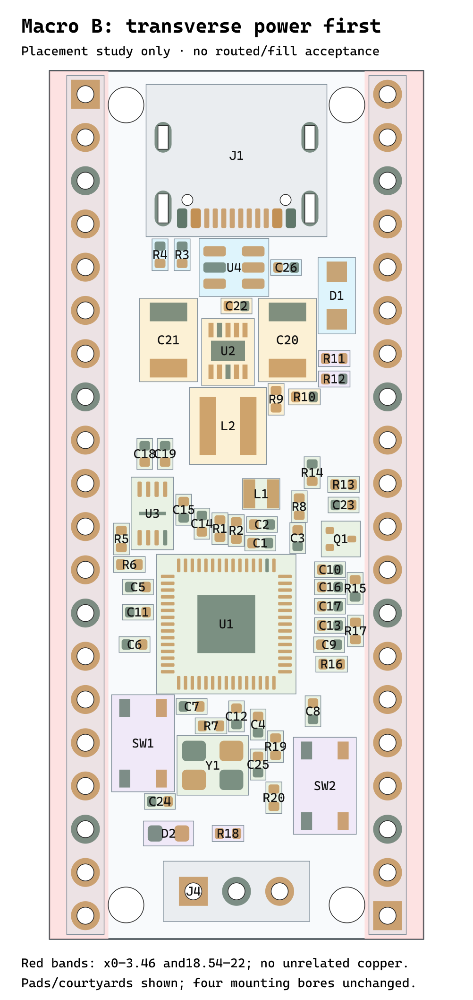

# Placement revision study

These are source-only placement alternatives developed after the request to keep GPIO header gaps clear for soldering and rework. **B is the preferred starting point for a new routing study; neither alternative is adopted or routed.**

The external power stage moves closer to USB/VSYS, while the MCU and its support groups move down the board. B widens the right-side pad-to-cap corridor from 0.89 to 1.49 mm. Local power and decoupling tradeoffs remain explicit in [the full report](REPORT.md).

Four corner mounting-hole conflicts and four existing USB pad-to-NPTH source-clearance findings remain unresolved. The preserved native project has not received these placements. This is not a completed layout, DRC pass, manufacturing approval, or proof of rework durability.

The original study files are copied byte-for-byte and pinned by manifest.json. macro-B.png is a raster rendering of the pinned SVG. The scripts retain paths from the development environment; they are evidence of that run, not a portable end-user command.
