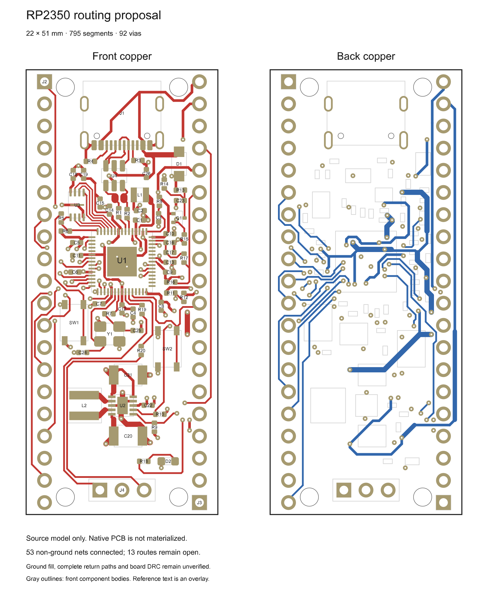

# RP2350 routing proposal V8

This is a reviewed **source proposal**, not a complete native PCB. It has 62
electrical components, 795 trace segments and 92 vias. Source copper connects
53 non-ground nets; 13 ordinary GPIO routes remain open. Ground fill, complete
return paths and whole-board native DRC are still unverified.

The 22 × 51 mm outline preserves the selected Pico header pitch and pinout.
Four 2.1 mm mounting bores use a 13 × 47 mm pattern, which intentionally differs
from Pico. This is not a drop-in mechanical-compatibility claim.

Placement and routing decisions include:

- Preserve the regulator's local input/output and switching-return connections;
  shorten its main ground connection without adding another hole.
- Keep dedicated MCU bypass paths. C6 moves to make room for the complete
  GPIO6–14 bank; C8's supply connection uses a shorter, 0.30 mm path.
- Keep the crystal circuit together while rearranging debug components to
  complete RUN. R15 rotates at the same center to complete VSYS sensing.
- Separate the LED route from the ADC reference area and retain an explicit
  proposed ground bridge across its remaining supply crossing.
- Use straight/45° copper and nominal 0.55/0.20 mm vias, with 0.50 mm hole spacing,
  0.15 mm minimum annular ring and the bound copper/edge-clearance rules.

These choices have scoped geometry, connectivity and electrical review. They do
not establish manufactured tolerances, noise immunity, thermal behavior, masked
USB impedance, or complete high-frequency return performance. In particular,
the quiet analog/digital ground separation is 0.159543 mm when the via annulus
is included; a trace-only distance must not replace that measurement.

`draft.json` records the design intent. `placements.json` records the selected
poses. `copper-proposal.json` contains proposed primitives and the explicit open
net list; its IDs are proposal IDs, not native deletion IDs. Actual authoring
must use the current bound project, verified native pads and fresh route
selections. The image omits ground fill and overlays reference text for review.

`snapshot.json` pins this snapshot and its files. Later experiments remain
separate until reviewed and adopted. See the [current project status](../../../docs/current-status-and-roadmap.md)
for managed native progress and remaining limitations.
