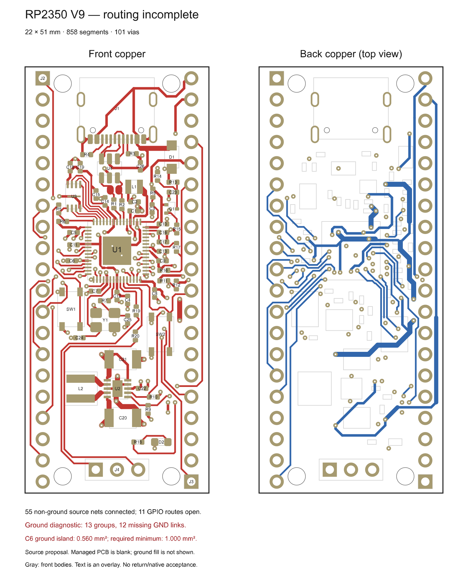

# RP2350 routing proposal V9

**Routing and ground returns are unfinished. This is an adopted source proposal,
not a clean or fabrication-ready PCB.** The frozen baseline contains 62 electrical
components, 858 trace segments and 101 vias. Source copper connects 55 non-ground
nets; 11 ordinary GPIO routes remain open.

Open routes: GPIO1, GPIO2, GPIO3, GPIO17, GPIO18, GPIO20, GPIO21, GPIO22,
GPIO26, GPIO27 and GPIO28. Some include partial escapes; they are not completed
header connections.

A disposable native ground-fill diagnostic found **13 separate GND groups and
12 missing GND links**. C6's stored ground island is **0.559538 mm²**, below the
declared 1 mm² minimum. Ground vias touching those islands do not establish a
complete return. See the [ground map](ground-map.svg) and
[diagnostic summary](ground-diagnostic-summary.json).

The diagnostic also retained small nominal QSPI/reference-ribbon misses and
substantial SWD terminal-reference gaps. Its configured numerical
clearance/short/hole/edge/width/annulus/courtyard categories reported zero findings;
that limited result does not override the unconnected, dangling, silkscreen,
reference or island failures. The disposable board is not the managed project;
the managed PCB remains blank at this snapshot.

Compared with the historical [V8 snapshot](../proposal-v8/README.md), V9 adopts
the R19/C25 rearrangement, coordinated east source escapes and the complete
GPIO16/19 pair. The selected pair keeps 3V3 distribution on the back layer and
preserves the regulator's local feedback topology. The alternative front
distribution merged into quiet feedback copper and remains unadopted.
**SW2 remains at 90°; the later 270°/GPIO20 experiment is not included.**
C5's placement region is wider, but its actual pose and copper remain unchanged.

The 22 × 51 mm outline retains the selected Pico header pitch and pinout.
Four 2.1 mm mounting bores use a 13 × 47 mm pattern, intentionally different from
Pico; this is not a drop-in mechanical-compatibility claim. Routing retains the
straight/45° policy, nominal 0.55/0.20 mm vias, 0.50 mm hole spacing and the bound
copper/edge rules.

`draft.json` records intent; `placements.json` contains selected poses;
`copper-proposal.json` contains source primitives and the open-net list.
Proposal IDs are not native selection/deletion IDs. The preview omits fill and
uses reference-text overlays. Actual authoring requires the bound project,
verified native pads and fresh route selections.

`snapshot.json` pins every file and its source identities. The ground
diagnostic retained a 1.6 mm reconstruction thickness rather than the intended
1.006 mm construction; it is 2D connectivity evidence, not impedance, HF-return,
noise, thermal, ESD or manufacturing qualification. Later experiments remain
separate until reviewed and adopted. See [project status](../../../docs/current-status-and-roadmap.md)
for managed native progress.
