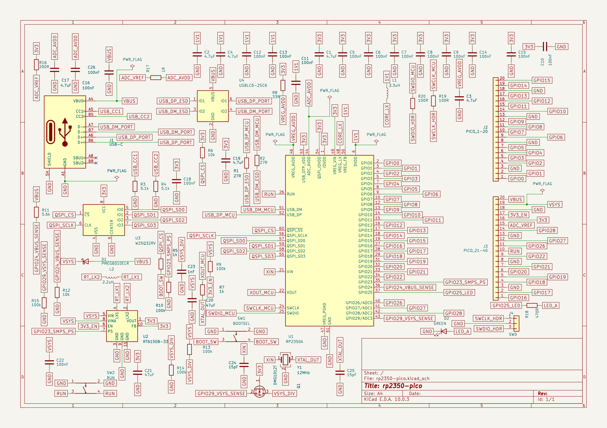

# RP2350 connected schematic V9

Open [rp2350-pico.kicad_sch](rp2350-pico.kicad_sch) in KiCad 10, or inspect the
[full-sheet SVG](rp2350-pico.svg). The schematic embeds its selected symbols.

This is the intact native schematic from the V9 workspace project: 62 physical
components, 67 functional nets, 260 functional endpoints, six power flags, and
two intentional USB SBU no-connects. The public native connectivity readback in
`connectivity.txt` matches every bound circuit group, including the separate
power-flag pins and both singleton no-connects. `snapshot.json` records the
source, preview, bundle and readback identities.

The schematic completed normal save, checkpoint and close before a later
outline operation encountered disk exhaustion. Its saved bytes remain exactly
unchanged. This snapshot preserves that schematic milestone; the working PCB
requires recovery and is not included here.

PCB placement, eleven ordinary GPIO routes, ground fill and return-path
verification remain unfinished. This circuit is a design candidate, not a
completed or manufacturing-approved board. See the
[current project status](../../../docs/current-status-and-roadmap.md) for the
native workflow and remaining limitations.

The native schematic and exported SVG retain KiCad's exact formatting,
including generated whitespace; they have not been reformatted.
