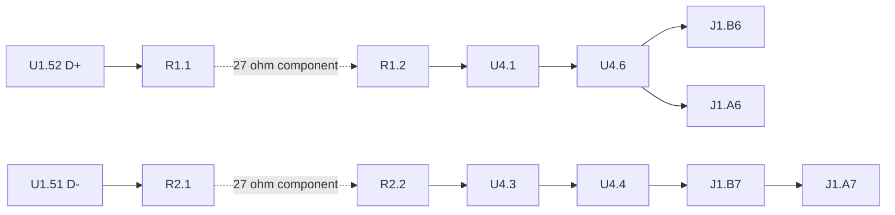

# Four-net USB route proposal

The [JSON proposal](usb-route-plan.json) contains **38 straight/45-degree F.Cu segments, all14 required anchors and zero vias**. At the current R2/U4 targets, it passes the actual pure channel-geometry checks and independent checks against all selected copper pads, drills and mounting bores. **It is source-based planning, not native routing authorization or a saved-board result.** Read actual native pad positions/source identities before using it.

No channel widths, clearances or length/skew/branch budgets were reduced. Required targets are R2 `(11.085,16.700)`, +90, and U4 `(9.600,12.150)`, +90. U4's move is inside its existing allowed region. All other electrical targets remain those in [placement-constraints.json](placement-constraints.json); the mounting bores use the current project13 x47 mm pattern. The JSON binds the exact input/footprint sources and records the earlier obstruction separately.

## Why candidate03's launch could not work

R2's former centre was `(11.085,16.900)`. The actual rounded copper gap from R2.1 to U1.53 was **0.557647 mm**. A minimum0.20 mm trace with0.20 mm clearance on each side requires0.600 mm.

The JSON retains a stronger certificate than that local gap alone: a closed polygon entirely inside foreign copper expanded by0.30 mm encloses U1.52 but excludes R1.1. Every polygon edge has both ends strictly inside the same convex expanded pad, so the whole edge is forbidden to the trace centre. Its minimum strict obstruction margin is0.021176 mm. A continuous F.Cu trace must cross that boundary; this is not merely a failed grid search or an overly conservative rectangular-pad approximation. Actual roundrect radii—0.05 mm for U1 and0.135 mm for R2—were used.

Moving only R2 north0.20 mm opens both source launches. For the recorded D+ launch, the analytic north-shift threshold is0.185183 mm;0.20 mm was selected. R1 remains fixed at its existing target. The proposed launches are1.584031 mm D+ and1.429056 mm D-, below their3 mm caps. Both source-resistor distances remain below2 mm. Current bounded component regions allow subsequent verified routing adjustments; candidate03's old exact-point region did not.

## Intentional channel topology

This is a connectivity diagram, not copper geometry. The dashed resistor connection is **not** a PCB segment or etch length. Both physical protection contacts on each polarity remain external-copper anchors; no imaginary line through the protection device is counted.

The sole three-way copper junction is at **U4.6's actual pad centre**. The positive branches approach both contacts below the interleaved connector row. The negative path reaches B7 and then ties to A7 above that row. This avoids a crossover, preserves polarity and gives every receiver a controlled path. An earlier direct D+ diagonal crossed intentional-NC copper J1.A8 and was rejected; NC pads remain obstacles.

## Measured proposal results

All lengths below are calculated copper-centreline lengths in the proposal. Resistor/package-internal delay is not included.

| Receiver pair | D+ source-to-contact mm | D- source-to-contact mm | Full copper skew mm | Limit |
| --- | --- | --- | --- | --- |
| J1.A6 / A7 | 11.532077 | 12.262372 | 0.730294 | <=25 mm paths, <=1 mm skew |
| J1.B6 / B7 | 10.707813 | 9.790412 | 0.917401 | <=25 mm paths, <=1 mm skew |

| Check | Calculated result | Bound / interpretation |
| --- | --- | --- |
| D+ launch | 1.584031 mm | <=3 mm |
| D- launch | 1.429056 mm | <=3 mm |
| D+ total four-net channel copper contribution | 14.667395 mm | <=35 mm, includes both positive branches and launch |
| D- total contribution | 12.262372 mm | <=35 mm, includes the connector tie and launch |
| Positive/negative port-tree total | 13.083364 /10.833316 mm | Each <=22 mm |
| Longest explicitly branched attachment-to-leaf path | 3.959582 mm | <=5 mm |
| Uncoupled port length, A pair | 9.423047 /10.308316 mm | Each <=12 mm |
| Uncoupled port length, B pair | 8.598782 /7.836356 mm | Each <=12 mm |
| Minimum opposing-trace / foreign-pad gap | 0.200000 mm | >=0.20 mm; finite-width capsule and actual rounded-pad geometry |
| Maximum nonbranch turn | 45 degrees | No right-angle trace turn |
| Shortest leg adjoining a turn | 0.175 mm | >=0.10 mm |
| Signal vias | 0 | Required |

The source channel assessor passes topology, all14 anchors, polarity, width/escape qualification, minimum/opposing gap, coupled gap, path and total length, path skew, branches, uncoupled length and layer-transition checks. Its exact integer-nanometre axis/diagonal length expressions remain in the JSON. The separate global junction check covers turns across polyline boundaries and confirms that the only multiway node is a declared pad centre.

**Only0.525 mm is the nominal wide coupled body**, at x=9.70 and10.72, y=14.75..15.275, width0.82 and gap0.20 mm. The other segments are0.20 mm terminal-qualified escapes. This satisfies the retained geometry budgets; it is **not proof that the entire channel is a controlled90-ohm transmission line**. Mask, launches, width steps, device packages and the full channel have not passed an impedance or USB/ESD performance qualification.

## Exact proposed polylines

Coordinates are millimetres from the northwest board corner, +X east and +Y south. Consecutive points define one straight segment. All paths are F.Cu. Segment widths change only at listed polyline boundaries; they are finite-width track proposals, not authored tapered polygons.

| Path / net | Width mm | Points in traversal order |
| --- | --- | --- |
| dp-launch / USB_DP_MCU | 0.2 | (10.9,18.55) -> (10.9,17.975) -> (10.335,17.41) -> (10.125,17.41) |
| dm-launch / USB_DM_MCU | 0.2 | (11.3,18.55) -> (11.3,17.6) -> (11.085,17.385) -> (11.085,17.21) |
| dp-lower-escape / USB_DP_PORT | 0.2 | (10.125,16.39) -> (10.125,15.7) -> (9.7,15.275) |
| dp-body / USB_DP_PORT | 0.82 | (9.7,15.275) -> (9.7,14.75) |
| dp-esd-south / USB_DP_PORT | 0.2 | (9.7,14.75) -> (8.65,13.7) -> (8.65,13.2875) |
| dp-esd-link / USB_DP_PORT | 0.2 | (8.65,13.2875) -> (8.65,11.0125) |
| dp-j1-b6 / USB_DP_PORT | 0.2 | (8.65,11.0125) -> (8.65,9.95) -> (8.9,9.7) -> (9.45,9.7) -> (9.75,9.4) -> (9.75,8.655) |
| dp-j1-a6 / USB_DP_PORT | 0.2 | (8.65,11.0125) -> (9,10.6625) -> (9,10.25) -> (9.2,10.05) -> (10.45,10.05) -> (10.75,9.75) -> (10.75,8.655) |
| dm-lower-escape / USB_DM_PORT | 0.2 | (11.085,16.19) -> (11.085,15.64) -> (10.72,15.275) |
| dm-body / USB_DM_PORT | 0.82 | (10.72,15.275) -> (10.72,14.75) |
| dm-esd-south / USB_DM_PORT | 0.2 | (10.72,14.75) -> (11.1,14.37) -> (11.1,14.12) -> (10.55,13.57) -> (10.55,13.2875) |
| dm-esd-link / USB_DM_PORT | 0.2 | (10.55,13.2875) -> (10.55,11.0125) |
| dm-j1-b7 / USB_DM_PORT | 0.2 | (10.55,11.0125) -> (11.25,10.3125) -> (11.25,8.655) |
| dm-j1-a7 / USB_DM_PORT | 0.2 | (11.25,8.655) -> (11.25,8.035) -> (10.97,7.755) -> (10.53,7.755) -> (10.25,8.035) -> (10.25,8.655) |

Both protection links are short real copper under/along the selected SOT23-6 footprint, with its actual VBUS/GND pads retained as obstacles. All unrelated footprints were included in the check; no omitted SBU/CC, shield stake or locator hole was used as free space.

## Clearance and return-path scope

The obstacle model includes267 electrical copper/drill primitives:265 actual copper pads and both connector NPTH locators, plus the four separate mounting bores. Rectangles, roundrects, ovals and circles use their actual source dimensions and rotations. Each proposed trace is treated as a capsule; clearance is measured to the pad's true rounded geometry, not only its centre. All selected other-net copper—including the intentional NC pads—remains active in this check.

The D+ launch clips **R2's assembly courtyard** by0.057574 mm, but stays0.370226 mm from its nominal body and satisfies the required clearance to its actual rounded copper. The source defines no copper keepout there. This is explicitly retained as an assembly-courtyard interaction; it is not a copper-rule waiver or an excuse to cross a keepout. No unrelated component courtyard is crossed.

The chosen0.90 mm reference margin beyond trace edges clears every currently known drill/bore, with minimum remaining static drill margin0.862836 mm. This is only a geometric exclusion screen. It does not verify future ground vias, actual fresh B.Cu fill, connected-plane islands, terminal return access or return-current performance. Those checks must use the authored, saved board.

The independent placement-only native fixture verifies the target component/bore arrangement with canonical net classes. It contains zero tracks/zones and therefore **does not validate these traces**. Its remaining silkscreen/unrouted findings are retained in the placement documentation. This route proposal itself did not open a native session, author copper, change a contract or modify application code.

## Before applying to the active native candidate

1. Read the current saved/native physical pad inventory and exact poses, shapes, layers, nets and source identities. Compare all14 anchors and the surrounding obstacles with this plan; replan on drift.
2. Confirm the active contract contains the accepted R2/U4 poses or permits them in its existing regions, and retains the same USB requirements. Do not use this document to override a bound contract.
3. Obtain fresh per-net route selections and use the actual tool schema. Plan-local segment names are not native UUIDs, deletion IDs or selection authority.
4. Apply through the qualified route tools, save and read back, inspect the rendered result, run independent native DRC and recollect complete-channel geometry/connectivity.
5. Author/refill GND and perform the current saved-board reference-coverage, return and applicable interface checks. Keep masked/full-channel impedance and physical USB/ESD qualification distinct from the geometric result.

The JSON is the machine-readable proposal and evidence record. Its `nativeAuthorization:false` and `nativeAccepted:false` are intentional. The root task owns native application after these prerequisites.
