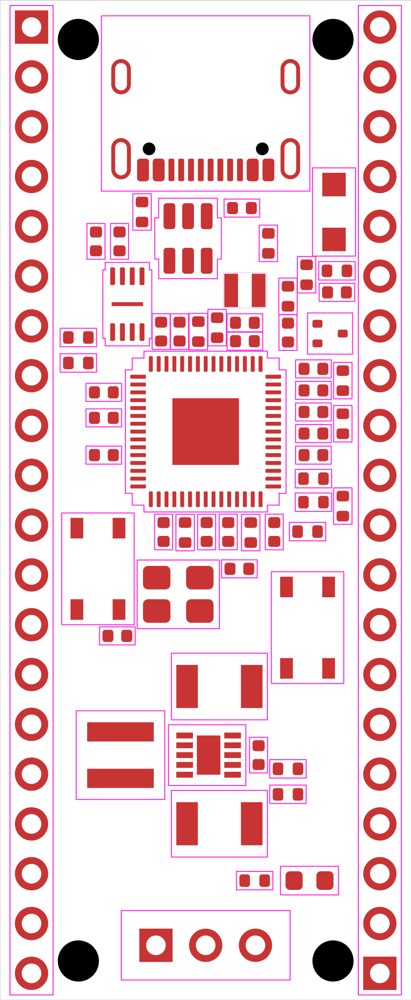

# RP2350 placement and clearance verification

The retained placement study uses all 62 electrical parts and four board-only
mounting bores. It is an isolated native KiCad engineering screen, separate from
the project being authored through public MCP calls. No complete routed board is
claimed.

The [placement constraints](../designs/rp2350-pico/placement-constraints.md) retain
specific target poses and bounded functional regions for later routing adjustments.
The MCU, local decoupling, flash, clock and power-conversion groups were placed
from their actual terminals. Two concrete route/mechanical findings changed the
initial proposal:

- R2 moved 0.20 mm north, opening the MCU's USB D+ escape. U4 subsequently moved
  0.25 mm south within its region to support the complete USB branch geometry.
- The four Ø2.1 mm mounting bores moved to a **13 × 47 mm** rectangle. This clears
  the USB connector courtyard. All forty Pico header contacts remain unchanged;
  the mounting-hole pattern differs from Pico.

The final native placement screen verifies 66 footprints, 281 physical pads,
262 pin assignments, all 65 exact net-class mappings and the declared 1.006 mm
construction. It reports no targeted copper, drilled-hole, board-edge or
component/mounting-courtyard placement violations. The canonical rules and their
severities were retained.

The initial final-position screen still has **238 silkscreen warnings and 194
unrouted connections**. Every silk warning involves a Reference field. An isolated
atomic hide-only trial using the new field helper removes all 238 warnings while
preserving all pads, nets, poses, UUIDs, 53 models, 114 courtyard graphics and
every unrelated source byte. Its native DRC has zero violations and still 194
unrouted connections. Six unconnected witness pairs select different coincident
USB-pad UUIDs after native reload; both raw reports remain preserved. This
qualifies helper serialization, not public-tool execution or completed routing.

The historical four-net [USB route proposal](../designs/rp2350-pico/usb-route-plan.md)
contains 38 segments connecting all 14 signal anchors with no vias. A subsequent
isolated native diagnostic wrote those exact segments and verified every USB
anchor: native DRC reports zero violations and 184 remaining unrouted connections,
none on USB. It preserves all 66 footprints, 281 pads and the exact candidate06
classes, including POWER_FINE. Only 0.525 mm is nominal coupled body; the remaining
routing uses declared terminal escapes. Fresh plane/reference checks and
masked-channel impedance remain unverified.

Joint routing then exposed limitations that the placement-only pass could not
establish. C14/C15 obstruct the complete QSPI bus, and the old USB protection
model required unnecessary external links across the USBLC6's internal channels.
The [manufacturer-backed model correction](research/rp2350-pico/usb-feedthrough-model.md)
retains all physical pins on six native signal nets and opens local supply/ground
access. The [power plan](../designs/rp2350-pico/power-route-plan.json) also screens
all 263 connected physical anchors together: U1.39/48/50/53 need bounded 0.20 mm
power escapes with the original clearances. The revised flash, decoupling and power
placement remains a joint source-plan proposal until its complete routes and
native readback are verified. Neither the earlier DRC pass nor the revised source
proposal establishes a finished board.

Local immutable evidence is retained under
`destination-verification/rp2350-placement-native-screen-01`, including the failed
original positions, corrected canonical-netclass reports, final source audit and
`field-hide-only-01` qualification and the later `usb38-candidate06-01` diagnostic.
The first scratch saves reset their net classes
to a stricter default; those preliminary reports were preserved and replaced by
separate checks with every exact class restored and byte-guarded.

Final placement PCB SHA-256:
`dfe2a7276ff16273915914ea82df8036bdc1cc4ef0a894f2476ada520427f25c`.
Hide-only diagnostic PCB SHA-256:
`8954aacfa5144142af774b4f32934ae6365346d1bb22564d8ae9598c10d2ceb8`.
The [candidate status](../designs/rp2350-pico/candidate-readiness.md) records actual
public-MCP progress and the remaining schematic work.
