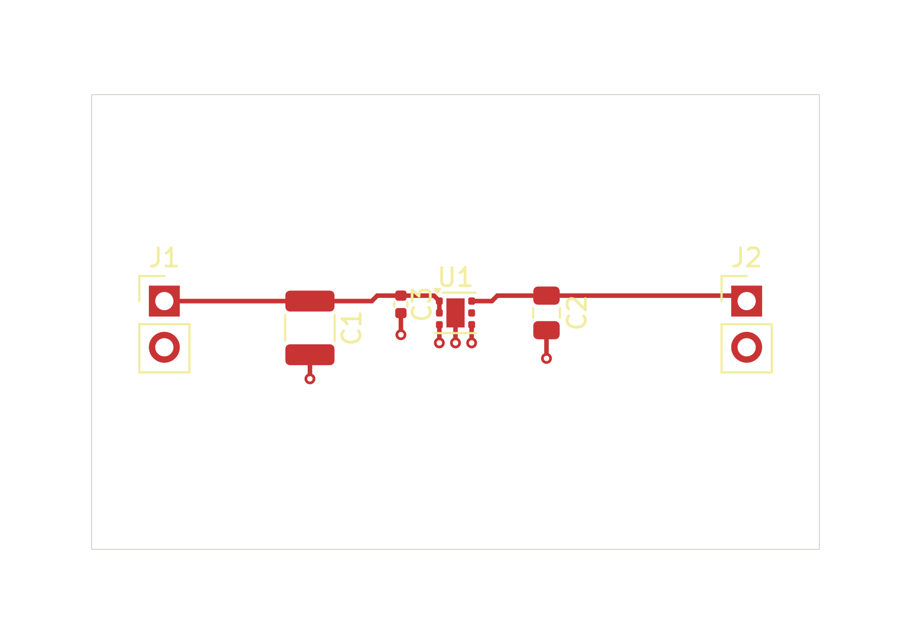
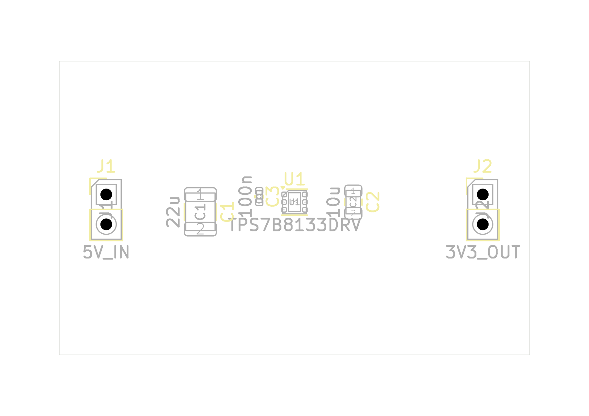

# WSON regulator toolbox proof

This six-component KiCad 10.0.3 example records a model-directed EvlEDA toolbox
authoring session over the public MCP STDIO interface, followed by a fresh
read-only reopen. It demonstrates native authoring and saved-source inspection.
**Design acceptance remains incomplete (`accepted: false`). This is not a
manufacturing release or a physically qualified regulator.**

Open `wson-regulator.kicad_pro` in KiCad. The six native source files are exact
copies of the saved authoring result; SHA-256 hashes and the qualification scope
are in [qualification.json](qualification.json). The two PNGs are authoring-session
previews. Private session logs, configuration, leases and checkpoint authority
are not part of this example.

The source uses stock KiCad 10 libraries through `${KICAD10_SYMBOL_DIR}` and
`${KICAD10_FOOTPRINT_DIR}`. Their original library-table paths are preserved
byte-for-byte. On another installation, configure those KiCad path variables
to the installed stock libraries; the Windows source session does not prove
path or library portability. Preserve this snapshot and edit a copy if adapting it.

## Observed software results

| Check | Result |
| --- | --- |
| Saved board | 6 footprints, 18 tracks, 6 vias, one B.Cu GND zone |
| Terminal inventory | 19 physical pad features; 17 logical terminals, including 16 functional terminals and one intentional NC |
| Functional connectivity | All three nets connected: VIN_5V, VOUT_3V3 and GND |
| Native checks | ERC 0 reported violations; generic DRC 0; strict schematic parity 0 |
| Literal junction geometry | 10 junctions measured, 0 violations |
| Authoring plane acceptance | Incomplete: 9 pass, 38 unknown, 0 fail; `accepted: false` |
| Fresh read-only plane acceptance | Incomplete: 0 pass, 47 unknown, 0 fail; `accepted: false` |

ERC retained four ignored checks, including the footprint-filter check; DRC
retained five ignored checks. Their exact keys are in `qualification.json`.
These zero-violation reports do not establish all-checks or electrical acceptance.

The plane inventory covers all 19 pad features, 6 vias and 10 bores. Two GND
connector bores intersect a cached fill hole or boundary enclosure. Drill-aware
topology and copper area therefore remain unknown. Thermal-spoke dimensions
and minimum copper width were not measured; configured rules are not measurements.

The fresh read-only session verified inventory, all three functional nets and
all six source hashes. It deliberately had no fill witness from that new session,
so its plane assessment remained unknown. Both sessions closed normally; final
observations found unchanged source hashes, no markers and no native processes.

## Engineering limits

U1 is the TPS7B8133DRVR fixed 3.3 V regulator in the stock WSON-6 exposed-pad
footprint. C1/C2/C3 use GRM32ER71E226KE15L (22 uF, 1210), GRM21BR61E106KA73L
(10 uF, 0805) and GRM155R71H104KE14D (100 nF, 0402). J1/J2 connector MPNs remain
unselected. The draft assumes 4.75-5.25 V input, 1-100 mA load and 25 C ambient.

Effective C1 must remain at least 10 uF; effective C2 must remain within 1-200 uF
and satisfy the regulator's 0.001-5 ohm ESR range at 10 kHz. Manufacturer typical
curves support component selection but do not guarantee these limits over
tolerance, DC bias, actual ripple, temperature and aging. Full footprint/package
verification, assembly suitability, stability, transient behavior and thermal
performance remain unqualified. See the [TI datasheet](https://www.ti.com/lit/ds/symlink/tps7b81.pdf)
for the regulator requirements; no physical board or load test is represented here.

## Previews

The top preview excludes B.Cu and therefore does not show the GND plane.

