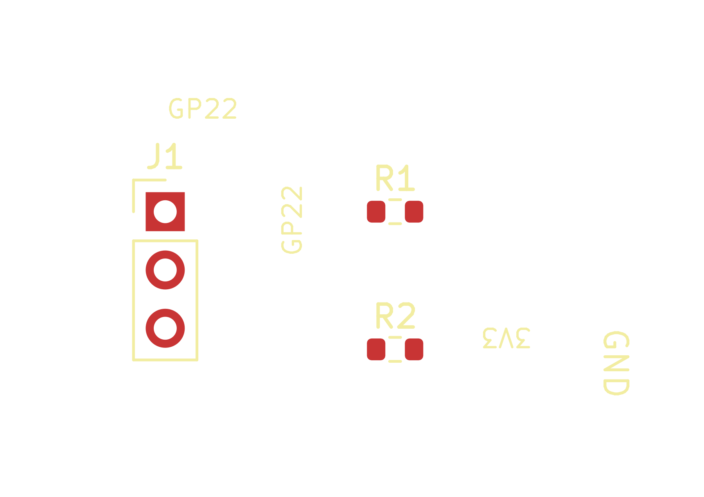

# Native cardinal silkscreen qualification

The public `pcb_add_text` operation saved and read back labels at **0°, 90°,
180° and 270°** in KiCad 10.0.3 using immutable host22 and the unchanged DOC12
runtime. All four additions preserved the existing PCB content and the four
other native source files. The project and client closed normally.

[Native project](native/cardinal-text-qualification.kicad_pro) ·
[PCB](native/cardinal-text-qualification.kicad_pcb) ·
[SVG](previews/board-top.svg) ·
[Qualification summary](evidence/qualification-summary.json)

This is a scoped text fixture: three synchronized and placed footprints, seven
verified physical pads, four text objects, no routing and no Edge.Cuts outline.
It does not establish a completed divider, RP2350 label fit, or board acceptance.
The native library tables retain machine-specific Windows paths.

The trial exercised coordinates including **4.000004 mm** and font size
**0.800249 mm**, which must survive the pinned KiPy truncating unit conversion.
Actual saved coordinates and font sizes matched the materialized requests
exactly. The [four mutation receipts and intermediate PCBs](evidence/) retain
each step; the [normal-close proof](evidence/normal-close-proof.json) binds the
final five native source identities.

Complete physical materialization is a prerequisite. An earlier isolated empty
fixture was rejected before any source change and retained for recovery review.
It was not reused or relabeled as successful. This fixture authored the three
symbols, applied and verified their schematic connectivity, synchronized the
PCB, placed all footprints, and inspected all seven physical pads before text.

The original native SVG was also measured as line-stroke ink. At 0.8 mm font
size, `GP22` occupies approximately **2.919 × 0.900 mm**; rotating it swaps those
dimensions. Its length exceeds the RP2350 header's 2.54 mm pitch. The
[ink metrics](evidence/native-text-ink-metrics.json) support using compact GPIO
numbers and a legend; they are rounded plot measurements, not nanometre or DRC
evidence. Final silkscreen placement still requires native board review.

Final PCB SHA-256:
`beaa8e33fc16ec23d17efb299715a3dfc8083120f2b3867aa6e087da682fcae3`.

Native V1 text insertion is demonstrated here. V2 authoring/save behavior is
covered separately by source tests; the RP2350's own labels remain pending.
