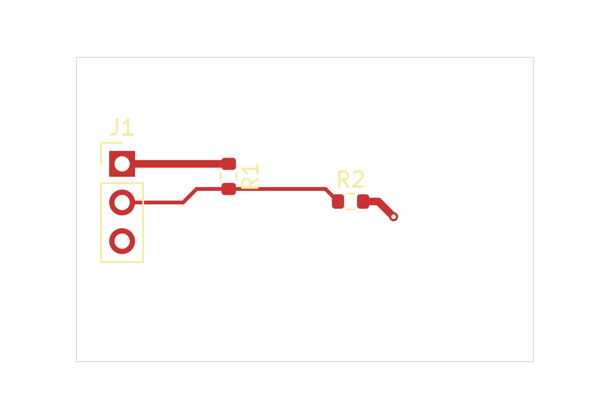

# Native compact plane-receipt qualification

**Plane creation, refill, mandatory Save/readback and normal close passed** using
the immutable host23 build with the separately pinned DOC14 Python runtime.
The source-equivalent UPDATE saved even though the resulting PCB bytes were
identical. Every native source/PAD record and ordered RPC observation was retained.

This is a 30 × 20 mm software fixture with three footprints, seven physical
pads, eight tracks, one via and one bottom ground zone. All three nets have
complete native physical-pad reachability. Configured ERC and DRC report zero
findings; native visual QA reports none. Five measured turns have no violations
or unresolved junctions. These checks retain their configured exclusions.

Open the [project](native/plane-stage-doc14.kicad_pro),
[PCB](native/plane-stage-doc14.kicad_pcb) or
[schematic](native/plane-stage-doc14.kicad_sch).
The six native files are exact byte copies; library tables retain absolute
approved Windows paths. This is not a portable library installation.

[Top SVG](previews/top.svg) · [Assembly PNG](previews/assembly.png) ·
[Assembly SVG](previews/assembly.svg)

Both views were inspected. The top export does not show the B.Cu plane; source,
native stage and endpoint observations establish the scoped plane-operation result.

## What was verified

- The compact CREATE receipt is 178,961 bytes; UPDATE is 201,314 bytes. Each
  contains all 30 native RPC observations and a pool of all seven native PADs.
- The host validated both receipts, the requested zone/settings, source
  preservation, actual unfill/fill observations and individual PAD queries.
- Both operations completed mandatory native save and saved-source readback.
  Tracks, vias, footprints and the five non-PCB source files were preserved.
- [Normal close](evidence/normal-close-proof.json) published a checkpoint and
  removed the lease, editor lock and unsafe state. The client then confirmed an
  idle workspace before SDK shutdown.
- All six RP2350 sources remained unchanged. No RP2350 plane was applied in
  this qualification.

See the [operation summary](evidence/summary.json),
[CREATE response](evidence/plane-create-response.json),
[UPDATE response](evidence/plane-update-response.json),
[endpoint observation](evidence/endpoint-response.json),
[native checks](evidence/checks-response.json), and
[plane assessment](evidence/plane-assessment-response.json).
Raw private stage/PAD diagnostics remain local; their identities are retained.

The fixture PCB is 19,827 bytes, SHA-256
`b8639f5ca87174878ddd201ebdd898c3b403d885b3ed4f57292c70195265dc38`.

## Limits and preserved failure

**The fixture is not electrically accepted.** Its `reference:VIN` row fails
because the required reference ribbon intersects a source-verified round drill
bore. Plane-net drill-clipped continuity, actual minimum copper/thermal widths,
effective clearance interactions and other mandatory rows remain unknown.
`accepted` and `fabricationAuthorized` remain false. Clean configured DRC does
not override these findings.

The first DOC13 live trial exposed an encoder type error: native PAD Any records
were `OrderedDict`, and an exact-`dict` test left them inline. The host rejected
that malformed receipt before Save. Its saved board, complete failed receipt
and unsaved plane source were preserved; the unsaved stage was discarded through
the owned close dialog. Its lease and unsafe marker remain. It is not a normal
resumable checkpoint. See the retained [failure review](evidence/failed-doc13-rejected-stage-review.json)
and [closure record](evidence/failed-doc13-recovery-closure.json).

DOC14 fixes the mapping type and logical work counting. The [implementation
report](../../docs/plane-receipt-compaction.md) covers compatibility, unchanged
limits, software tests and the synthetic 64-pad scaling exercise. That exercise
is not a valid native PCB or evidence of RP2350 fill behavior.
