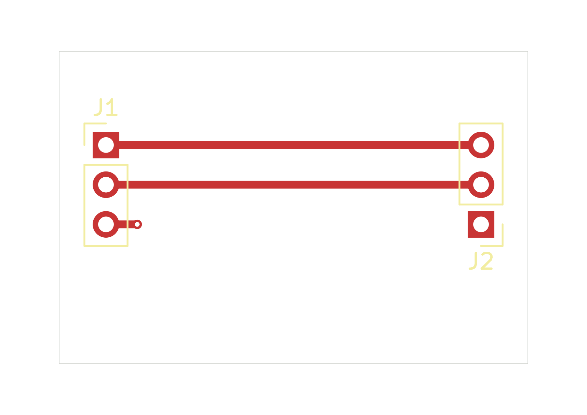

# Native four-layer authoring qualification

The public workspace created, synchronized, placed and routed this separate
30 × 20 mm fixture in KiCad 10.0.3. It saved five tracks, one ordinary through-via,
six physical pads and two internal GND planes. All three functional nets connect.
Both planes' source/native configurations and filled geometry verify independently;
the complete native inventory includes the via on all four enabled copper layers.

[Native project](native/fourlayer-headers-d.kicad_pro) ·
[PCB](native/fourlayer-headers-d.kicad_pcb) ·
[Plane assessment](evidence/verified-plane.json) ·
[Provenance](evidence/provenance.json)

Configured ERC and DRC report zero findings, with their excluded categories
retained in [validation](evidence/verified-validation.json). Practice checks have
zero turn violations or unresolved junctions. Both normal reopen/refill cycles
preserved the six native source files byte for byte, and the final project and
client closed normally. No separate read-only reopen was performed.

**Overall acceptance remains false.** This is a software qualification fixture,
not a completed differential interface or fabrication recommendation. Its PTH
anchors are unsupported by the interface checker, and their bores intersect the
required reference ribbons. Whole-plane physical continuity remains unassessed.
The asymmetric construction and material values are explicitly synthetic.
Library tables retain the approved machine-specific paths.

Host37's source/UI type checks, backend build, helper packaging and 471 focused
tests passed. The DOC16 verifier checked all 8469 runtime files; three separate
mixed/unknown-manifest cases were rejected. These are scoped results, not a
full-suite pass. Earlier failed project allocations remain preserved and are
listed in the provenance record.

The original RP2350 board was not modified. It still has 14 disconnected nets;
this qualification enables its four-layer work but does not complete it.

PCB SHA-256:
`d2d8a50f52d5ac8e54e1be2cb50a613bb6145cd4dd3b2018f9e93ab9fee06861`.
