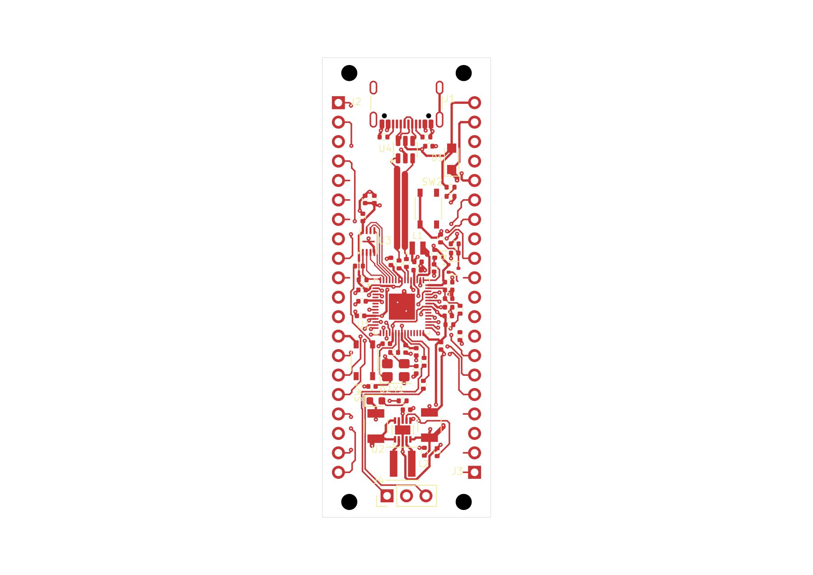

# Native placement-revision qualification

The public `evleda_revise_placement` operation now creates a separate authored KiCad project with revised placement constraints, preserving the original project and existing circuit/routing. This run uses the real RP2350 60-12 board on host30/DOC14.

The new project retains **829 tracks, 104 vias, 66 footprints and the same schematic**. No components were moved in this qualification. Only the two USB-resistor placement constraints were expanded; board dimensions, circuit, libraries, stackup, routing limits and the 2 mm termination-distance limit were preserved.

Original project: `b2e1adba-cf6c-4ccf-a51f-00f63320d6eb`. New project: `914f7760-c4c2-4bb8-9b51-b481242878a5`.

Open the [native project](native/rp2350-pico.kicad_pro), [PCB](native/rp2350-pico.kicad_pcb) or [schematic](native/rp2350-pico.kicad_sch). Library tables retain their approved absolute Windows paths.

[Top SVG](previews/board-top.svg) · [Assembly PNG](previews/board-assembly.png) · [Assembly SVG](previews/board-assembly.svg)

## Verified lifecycle

- Original project resumed and closed normally before revision, with all six source files unchanged.
- Ready revised intent created a new workspace allocation through the public operation. Circuit, tracks, vias and functional footprint data remained exact.
- The copied fill had no current-session authority. A new native UPDATE/refill completed mandatory save and readback.
- Saved/native fill geometry matched. The GPIO service audit remained clear with 40 own-pad leads; 631 measured turns had zero violations and eight unresolved junctions.
- Both inspected previews were byte-identical to the original board views.
- The revised project closed normally, then reopened in a new read-only connection using its stored lineage. Target and original sources remained unchanged, and read-only fill authority remained unknown.
- Both successful sessions closed normally and confirmed an idle workspace before SDK shutdown.

See [creation](evidence/revision-created.json), [before-fill assessment](evidence/revision-before-fill.json), [fresh assessment](evidence/revision-after-fill.json), [native endpoints](evidence/revision-endpoints.json), [normal close](evidence/revision-close-proof.json), and [read-only reopen](evidence/readonly-reopen-proof.json).

## Board status remains incomplete

The board still has **53 connected and 14 disconnected nets**, nine ground groups, 24 unconnected DRC errors and 13 dangling-item warnings. Configured ERC reports zero unexcluded findings. DRC exclusions and all failed/unknown acceptance rows remain in the complete reports. USB resistor movement/rerouting, other unfinished connections, junction review and functional labels remain open. Overall acceptance is false.

This is qualification of the revision workflow. It does not claim that the resistor-placement problem or the board is finished.

## Retained failures and fixes

Three earlier allocations were retained without rewriting or deleting their authority files:

- Session 42 stopped when netclass materialization changed JSON member order. Already-correct settings now remain byte-identical.
- Session 43 stopped at the saved/live PCB comparison. Remapped mounting-feature UUIDs now use the pinned native footprint ordering.
- Session 44 stopped on history-snapshot validation. The native history writer emitted the exact LF form of the prepared PCB; the history check now admits that exact representation alongside the exact observed live bytes. Primary files still require exact preservation.

The source comparison, serialization basis and history replay are retained in [evidence](evidence/). Failed allocations remain local for review. No cleanup or recovery marker was manually cleared.

The frozen build records retain type checks, backend compilation and the targeted regression results. The final history/revision run passed 90 tests and skipped one Windows file-symlink case because the host denied creation. Earlier netclass regressions also retained their opt-in native-clearance fixture skip. Live RP2350 native checks are recorded separately. This is not a new full-repository or CI pass.

## Saved identity

PCB SHA-256: `6652eeb08db813382593dd8af0af00b7210ec758b4f78b3fbb7b4983b8bcd69b`.
Final read-only close checkpoint: `0f94454ee31dc58492cf85e17bf2a84a828d4c664d8e46d67454b08fbeb0c8f7`.

[Usage and source-preservation rules](../../docs/placement-revision.md).
